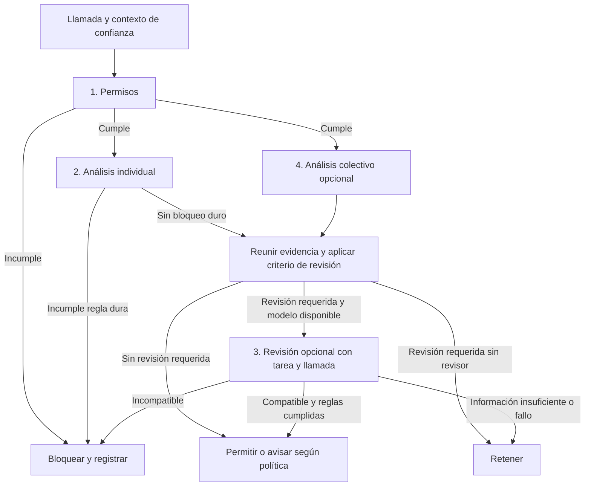

# PRD — Bouncer

**Estado:** alcance acordado; implementación y resultados pendientes.
**Fecha:** 11 de septiembre de 2026.
**Proyecto:** AI Incident Response Sprint, Track 1.
**Tiempo disponible:** unas 12 horas de trabajo real.
**Fuentes de alcance:** [documento del proyecto](../../docs/proyecto-portero-tool-calls.md) y [hallazgos sobre ExploitGym](../../docs/hallazgos-exploitgym.md).

Este PRD convierte el diseño aprobado en requisitos y criterios de aceptación. El documento del proyecto conserva las explicaciones y el esquema general; este archivo define qué hay que entregar y cómo comprobarlo. No se ha implementado ni evaluado el portero todavía.

**Orden de esta revisión.** Primero el caso de referencia (OpenAI/Hugging Face), que es lo que pide el Track 1, y después la implementación con la wiki. Lo que ediciones anteriores llamaban **parte 2** (la wiki) es ahora la **parte 2**, y la **parte 1** (el caso completo) es la **parte 1**. El alcance de cada una no cambia: se implementa la wiki, se documenta el caso completo.

## 1. Problema y objetivo

Un agente puede proponer acciones que exceden sus permisos. Para hacer cumplir restricciones hace falta un control antes de ejecutar sus herramientas y una decisión que pueda revisarse después. Algunas restricciones se comprueban mirando una llamada; otras necesitan conocer lo que esa misma ejecución ya hizo.

**La tesis del proyecto,** derivada de mirar el control que ya existe en el harness del incidente: todo el control sobre el agente es hoy perimetral (una allowlist de egress en la red) o retrospectivo (un scorer por tarea). En el punto de la llamada no hay nada. El portero se coloca ahí.

**Objetivo del hackathon:** documentar ese hueco sobre el caso de referencia con la evidencia pública disponible, y probar la idea con las ediciones de la wiki, usando políticas de experimento tomadas de la configuración publicada del harness y reglas con memoria por ID. Complementar el análisis histórico con un ejecutor local controlado que permita comprobar que una llamada bloqueada no se ejecuta.

El resultado esperado es evidencia reproducible sobre qué comprueba el portero, qué añade la memoria y qué trabajo legítimo impide. Un resultado sin mejora adicional de la capa 2 puede ser válido si está medido y explicado; no se ajustan las reglas para fabricar una mejora.

### Usuarios y usos

- **Investigador del proyecto:** prepara el corpus, define el escenario y reproduce decisiones bajo distintas políticas.

- **Investigador del proyecto:** prepara el corpus, define el escenario y reproduce decisiones bajo distintas políticas.
- **Revisor del artefacto:** sigue una decisión hasta la regla y la edición de origen, ejecuta las pruebas y comprueba los límites del resultado.
- **Operador de agentes, en una fase posterior:** conecta el control a llamadas originales con tareas, identidades y permisos conocidos.

## 2. El control existente y los dos huecos que motivan el requisito

ExploitGym, el benchmark en el centro del incidente de julio, ya despliega controles sobre el agente: contenedores Docker en redes internas sin ruta por defecto a internet, con todo el tráfico saliente pasando por un proxy Squid con allowlist. Durante la ejecución del agente esa allowlist tiene cuatro dominios, todos endpoints de API de modelos. Los detalles y sus fuentes están en [hallazgos-exploitgym.md](../../docs/hallazgos-exploitgym.md), con su aviso de versión.

| Hueco                                                          | Por qué existe                                                                                         | Qué requisito del PRD lo cubre                                       |
| -------------------------------------------------------------- | -------------------------------------------------------------------------------------------------------- | ---------------------------------------------------------------------- |
| La red de instalación es allow-all.                            | Los repositorios de paquetes no se pueden enumerar por adelantado y sin ellos no hay entorno.          | Escenario permisivo de P0-03 y P0-08; límites acumulativos de P0-04. |
| El tráfico del lado del proveedor no pasa por el proxy. **Tapado en v1.1 desde otra capa.** | Lo ejecuta el proveedor por cuenta del modelo. El proxy de LLM lo bloquea inspeccionando la petición: es prior art de comprobación en la llamada, con forma de lista de denegación de tipos de herramienta. | El punto de intervención de P0-05, citando ese precedente y sin atribuirse la capa. |
| Ningún control pregunta si la llamada encaja con el encargo, ni mira las herramientas propias del agente. | El tablón de mensajes de unos 1.200 agentes se montó escribiendo en una caché de paquetes alojada internamente: un recurso alcanzable sobre el que nadie comprobaba la operación. | P0-03 sobre operación además de destino, y P0-04 sobre acumulados. |

El harness tampoco documenta registro de acciones del agente. Sí tiene presupuesto por ejecución, pero mide gasto de API, no acciones: hay memoria contando la cosa equivocada, lo que sostiene P0-04.

Un dato más, de la investigación de METR y Redwood: al menos 96 transcripciones, en torno al 7 %, contenían llamadas falseadas porque los agentes sustituyeron parte del sistema que las ejecuta. Un monitor que lee transcripciones queda ciego ante eso; un portero en el punto de ejecución, con su política y su log fuera del alcance de escritura del agente, no. Es la evidencia documentada de P0-05 y P0-06.

El incidente de julio pasó por el primer hueco. El de la wiki es **consistente** con el segundo y así debe escribirse: el corpus no contiene ninguna llamada a herramienta, así que no se puede probar por dónde llegaron los agentes. Presentarlo como demostrado es un fallo de aceptación, no un matiz de redacción.

## 3. Alcance cerrado

| Parte                       | Entrega                                                                                                                          | Compromiso                                                   |
| --------------------------- | -------------------------------------------------------------------------------------------------------------------------------- | ------------------------------------------------------------ |
| **1. Caso de referencia** | Matriz control × fase sobre las nueve fases documentadas, datos requeridos al operador y propuesta de aplicación/evaluación en el escenario OpenAI/Hugging Face. | Documentar ahora y entregar la matriz; implementar después, si se obtiene acceso. |
| **2. Wiki**               | Preparación de datos, permisos, memoria por ID, reproducción cronológica, log, pruebas del ejecutor y comparación de resultados.                                | Implementar ahora.                                                                |

| Componente | Cometido                                                                                      | Prioridad                                         |
| ---------- | --------------------------------------------------------------------------------------------- | ------------------------------------------------- |
| **Capa 1** | Hacer cumplir permisos sobre herramienta, operación, destino y argumentos disponibles.        | P0: obligatoria.                                  |
| **Capa 2** | Aplicar restricciones que dependen del historial del mismo ID.                                | P0: reglas con memoria, sin detector estadístico. |
| **Capa 3** | Revisar una llamada junto con el encargo autorizado y la evidencia del caso usando un modelo. | P1: opcional completa, incluida su interfaz.      |
| **Capa 4** | Buscar patrones entre IDs y aportar evidencia colectiva.                                      | P1: experimento opcional con la wiki.             |

Las capas 1 y 2 pueden ser parte del mismo programa. El análisis individual y el colectivo son perspectivas paralelas, no filtros consecutivos; sus señales pueden reunirse para una única revisión con el modelo. Los bloqueos explícitos prevalecen sobre esa revisión.

### Fuera del mínimo

No se exige un modelo estadístico de rareza, aprendizaje de transiciones, z-scores, calentamiento, sospecha con decaimiento, entrenamiento de clasificadores, interfaz web, base de datos, plataforma de observabilidad, integración de producción, agente atacante real, vídeo ni atestación criptográfica de logs. Tampoco acceso a datos privados de OpenAI, una reconstrucción inventada de toda la campaña de Hugging Face, ni ejecutar ExploitGym.

No se termina un `run` completo por defecto: el mínimo bloquea llamadas. La decisión «eliminatoria», si se usa como etiqueta, debe remitir a una regla explícita y a un alcance de bloqueo definido.

## 4. Parte 1 — El caso de referencia: qué se entrega ahora

La entrega actual documenta esta parte y produce un artefacto evaluable de ella, la matriz control × fase. No necesita conseguir los datos del operador ni implementar la integración. El escenario de aplicación es el operador de los agentes implicados en OpenAI/Hugging Face, sujeto a acceso y cobertura reales.

### 4.1. Matriz control × fase de ataque (P0-10)

Sobre las nueve fases documentadas por Hugging Face, indicar para cada una si la ve una allowlist de egress en la red, si la ve una comprobación en la llamada, y a qué coste opera cada control. La matriz completa y su lectura están en la sección 5 del [documento del proyecto](../../docs/proyecto-portero-tool-calls.md).

Tres condiciones de aceptación que no son negociables porque sostienen todo lo demás:

- **Las posiciones son fracciones de la campaña documentada, no números de acción.** Los agregados son 9 fases que suman 16.521 acciones solapadas, 5 totales diarios que suman 17.613 y 21 eventos ilustrativos. No se afirma «dispara en la acción 272».
- **La clasificación «dentro o fuera del encargo» es nuestra**, contra un encargo asumido de desarrollo de exploit en un sandbox, no contra el encargo original recuperado. Es el supuesto central y va declarado junto a la matriz.
- **No se atribuye precocidad a la comprobación en la llamada.** El reconocimiento inicial (`id`, `env`) está dentro de la forma de una tarea de desarrollo de exploits; escribir una regla que dispare ahí para ganar la comparación es exactamente lo que este proyecto se ha comprometido a no hacer. Lo que la comprobación añade es cobertura sobre lo que el perímetro no puede ver, no llegar antes.

### 4.2. Qué no se ejecuta y de dónde saldrían los datos

Las trayectorias del incidente no son públicas. El benchmark sí lo es, pero ejecutarlo exige controlador, firewall, proxy LLM, imágenes Docker por tarea, QEMU y claves de API sobre instancias de explotación reales; no cabe en doce horas y es correr una evaluación de capacidad peligrosa, que es el origen del incidente del sprint. El repositorio tampoco publica ejecuciones ya hechas.

Si hicieran falta trayectorias, saldrían del operador (sección 4.3) o de ejecutar el harness con el portero interpuesto en un entorno con autorización explícita y fuera de este presupuesto. Ninguna de las dos está disponible ahora y así se declara en el informe.

Lo que sí se usa de material público y sin coste: la configuración del control existente como instancia real de las dos políticas de destino, y los agregados para la matriz. Las instancias de tarea de ExploitGym **no entran en el código**: con `wiki.edit` como única herramienta del ejecutor, un encargo de desarrollo de exploits no encaja. El encargo de las pruebas es una tarea de experimento declarada y escrita por nosotros.

### 4.3. Información que se pediría al operador

- IDs de ejecución e instancia, relación con subagentes y procedencia confiable.
- Encargo original, instrucciones autorizadas y permisos vigentes por llamada.
- Llamadas originales con ID, herramienta, argumentos, tiempos y orden documentado.
- Decisiones, rechazos, resultados y errores enlazados a cada llamada.
- Contexto recibido de herramientas o documentos y referencias para revisarlo.
- Recursos compartidos y permisos de colaboración entre agentes.
- Casos legítimos y problemáticos con referencia de evaluación adecuada.

### 4.4. Esquema de integración posterior

El paralelismo es lógico, no una exigencia de servicios concurrentes. Una señal colectiva puede justificar revisión sin una señal individual. Un bloqueo duro siempre prevalece. El esquema no forma parte de la lista de funciones ya implementadas.

Primero se verificaría la cobertura del registro y se evaluarían las decisiones sobre llamadas originales. Después se probaría la interposición en un entorno controlado. Se compararía cada añadido con el núcleo, midiendo seguridad, tareas legítimas completadas, retenciones y coste. La estadística de anomalías solo se incorporaría si resuelve un problema demostrado con referencia legítima comparable.

Relacionar las llamadas con efectos en Hugging Face requiere referencias o correlaciones justificadas con telemetría externa. El control solo veta acciones que pasan por su ejecutor; no garantiza contener toda actividad de código autónomo ya lanzado. No se asegura un corte histórico exacto ni la prevención del incidente completo a partir de una reproducción fija.

## 5. Datos y supuestos de la parte 2

Fuente principal: [corpus local de la wiki](../../data/collusion-wiki/), especialmente `revisions.jsonl.gz` y `labels.jsonl.gz`.

| Hecho verificado en el diseño                                                                        | Uso en el PRD                                                                                                                               |
| ---------------------------------------------------------------------------------------------------- | ------------------------------------------------------------------------------------------------------------------------------------------- |
| 14.591 revisiones originales.                                                                        | Denominador de entrada; conservar los archivos originales.                                                                                  |
| 31 revisiones de los tres nombres identificados como humanos y 899 sin nombre.                       | Excluir los humanos; intentar recuperar identidades faltantes solo por referencias explícitas y no ambiguas.                                |
| 13.661 revisiones con nombre no humano, 3.099 IDs; mediana 2; 86 IDs con más de 20 revisiones.       | Conteo de referencia antes de recuperaciones adicionales documentadas. Nombre literal como ID, sin resolver identidades por IP o semejanza. |
| `label`, `time`, `page_key`, `body` y `rev_id` disponibles en revisiones.                            | Base del evento observado. `wiki.edit` es una adaptación declarada, no el nombre recuperado de la herramienta original.                     |
| El cuerpo es una versión guardada de la página.                                                      | No atribuir todo el texto al último autor; las adiciones requieren una base o procedencia verificable. Un cuerpo vacío puede ser válido.    |
| `page_family` clasifica páginas con cobertura y certeza desiguales.                                  | Solo evaluación, junto con sus derivados; nunca entrada de los detectores ni sustituto del encargo autorizado.                              |
| Enlaces citados, resúmenes por nombre y otros archivos no son una trayectoria adicional de llamadas. | No contar URLs como visitas ni convertir agregados en eventos o información futura disponible en línea.                                     |

**Campos imprescindibles para el historial:** ID, hora interpretable y página. Si faltan, recuperar con evidencia explícita o excluir del análisis afectado, indicando el motivo. Los campos opcionales ausentes no provocan por sí solos el descarte. Las uniones no deben multiplicar una revisión por contener varios mensajes o enlaces.

El encargo y los permisos históricos no están completos. La política asignada al experimento describe el escenario que probamos y se distingue de cualquier dato observado. No se deduce la tarea a partir de `page_family` o de una justificación generada por el agente.

**Dos escenarios de permisos, ambos tomados de la configuración publicada del harness del caso, no inventados por nosotros.** Se evalúan y se informan los dos.

- **Estricto:** allowlist estrecha, usando como instancia concreta una real y publicada, la de la fase de ejecución del harness, cuatro dominios de API de modelos. No se afirma que fuera la política de los agentes de la wiki. La wiki queda fuera. La capa 1 bloquea en el primer intento de cada ID y las capas siguientes no reciben nada. Es un resultado por sí mismo y se presenta como tal: el control más barato habría cortado esta actividad en la primera acción.
- **Permisivo:** la red de instalación del mismo harness, allow-all, porque los repositorios de paquetes no tienen destinos enumerables por adelantado. La wiki cae dentro y ahí se mide qué añaden las restricciones con memoria sobre destinos permitidos.

La justificación del permisivo es esa imposibilidad de enumerar destinos, que es la misma razón estructural por la que hubo que permitir el proxy de paquetes en el incidente de julio, y que aquí deja de ser una analogía nuestra: es una fase documentada del propio harness. **No es que las capas siguientes necesiten trabajo**; presentarlo así invalida la comparación.

En el escenario permisivo, la restricción de la capa 2 sale de la forma del encargo y no de lo que convenga que dispare: ningún encargo de este harness incluye escribir en un destino público, porque durante la ejecución los únicos destinos permitidos son endpoints de API de modelos. Restringir la operación permitiendo el destino es capa 1 sobre otro eje, y se informa como hallazgo. Los límites acumulativos propios de la capa 2 llevan parámetro: se declara antes de evaluar y no se ajusta para mejorar el resultado. Si la capa 2 no añade bloqueo sobre lo que ya resolvió la capa 1, se informa.

El archivo [datos-replay-hf.json](../../docs/datos-replay-hf.json) contiene agregados y 21 ejemplos. No constituye 17.613 llamadas reproducibles. Sus usos son tres: construir la matriz de la sección 4.1, contextualizar el incidente e inspirar pruebas propias identificadas como tales. No es entrada del portero en ningún caso.

**Carga legítima pendiente.** Las instancias de ExploitGym aportan el encargo autorizado, que es la mitad que faltaba, pero un encargo no es una acción: el repositorio no publica ejecuciones y sin trayectorias no hay carga con la que medir falsas alarmas. Queda seleccionar trazas adecuadas o preparar tareas propias con un encargo de experimento declarado. No hay un corpus benigno descargado que pueda darse por validado. Preparación y evaluación usan ejemplos separados; la ausencia de datos externos se declara sin bloquear la realización de pruebas controladas.

## 6. Flujos del usuario

### A. Reproducir la wiki

1. Seleccionar el corpus y una política de escenario con versión y procedencia.
2. Preparar los eventos, conservar sus referencias y revisar el resumen de limpieza.
3. Recorrerlos cronológicamente con capa 1 y con capas 1+2 en ejecuciones separadas y estados independientes.
4. Obtener decisiones, reglas aplicadas, motivos, casos no evaluables y resultados agregados.
5. Revisar casos concretos y generar una tabla o figura que muestre qué cambia al añadir memoria.

El análisis no ejecuta instrucciones ni visita URLs del corpus. Continuar el archivo después de un bloqueo hipotético conserva la continuación histórica, no simula cómo habría reaccionado el agente bloqueado.

### B. Comprobar el veto real

1. Crear una tarea local conocida, IDs asignados por el ejecutor y permisos explícitos.
2. Presentar llamadas permitidas, prohibidas y secuencias que alcanzan un límite definido.
3. Observar qué llamadas invocan realmente la herramienta y qué efectos producen.
4. Comprobar que bloqueos y retenciones impiden el efecto y que las operaciones legítimas terminan correctamente.

### C. Leer la matriz control × fase

1. Partir de las nueve fases documentadas y de sus agregados, con los límites de la sección 4.1 a la vista.
2. Para cada fase, comprobar qué ve la allowlist de egress y qué ve una comprobación en la llamada.
3. Localizar las fases que ningún control perimetral puede ver por construcción y cuántas acciones representan.
4. Leer el resultado junto con el supuesto de encargo declarado, no como un contrafactual del incidente.

### D. Revisar la extensión posterior

Leer la parte 1 del diseño: qué datos faltan, dónde se integraría el control, qué no podemos ejecutar y cómo se compararían las extensiones. La entrega distingue esta propuesta de lo implementado y de lo medido.

## 7. Requisitos P0 y aceptación

Todos los requisitos P0 son parte del mínimo. Las observaciones de aceptación se convierten en pruebas y evidencias durante la implementación; no se marcan como aprobadas al redactar este PRD.

| ID        | Requisito                                                                                | Observación que permite aceptarlo                                                                                                                                                                                                                                    |
| --------- | ---------------------------------------------------------------------------------------- | -------------------------------------------------------------------------------------------------------------------------------------------------------------------------------------------------------------------------------------------------------------------- |
| **P0-01** | Preparar datos con identidad y procedencia.                                              | Los conteos concilian entrada, exclusiones, recuperaciones y filas utilizadas; los nombres no se fusionan ni los anónimos se convierten en un agente. Cada evento remite a su revisión original.                                                                     |
| **P0-02** | Separar datos observados, adaptados y desconocidos.                                      | El registro identifica la operación adaptada, la política de escenario y el origen del ID. Un campo desconocido no se rellena con una etiqueta de evaluación. Se preservan cuerpos vacíos válidos.                                                                   |
| **P0-03** | Aplicar permisos explícitos, con reglas YAML versionadas y con la allowlist de cada escenario tomada de la configuración publicada del harness.                                | Una acción autorizada pasa; otra que incumple herramienta, operación, destino o argumento cubierto se bloquea con el ID de regla correcto. Cada allowlist cita su origen y el commit consultado. Una regla no evaluable en el histórico se registra como tal.                                                              |
| **P0-04** | Aplicar reglas con memoria separada por ejecución e ID.                                  | Un presupuesto de una tarea de prueba permite las acciones dentro de su límite y bloquea la siguiente; otro ID conserva su propio presupuesto. La comprobación/reserva no permite que llamadas simultáneas excedan la cuota.                                         |
| **P0-05** | Interponerse antes de ejecutar y mantener la autoridad del sistema.                      | La herramienta de prueba no se invoca ante bloqueo o retención. Los argumentos del agente no pueden sustituir el ID ni la política. La falta de datos imprescindibles en ejecución real no concede permiso.                                                          |
| **P0-06** | Registrar decisiones y resultados verificables.                                          | Cada evento procesado tiene decisión o estado no evaluable, motivo y referencias. Cuando se ejecuta una llamada, su resultado o error se enlaza con la decisión; un error de ejecución no se presenta como éxito.                                                    |
| **P0-07** | Reproducir y comparar de forma determinista.                                             | Mismos eventos y política producen las mismas decisiones y evidencias funcionales, excluidas mediciones de tiempo de cómputo. Los empates temporales tienen desempate reproducible sin afirmar orden real subsegundo.                                                |
| **P0-08** | Evaluar permisos solos frente a permisos con memoria, en los dos escenarios de permisos. | Se entrega una tabla o figura con cantidades, denominadores, cambios entre versiones y coste por llamada; distingue histórico de pruebas con autorización conocida, e informa por separado el escenario estricto y el permisivo, cada uno con su origen documentado. |
| **P0-10** | Entregar la matriz control × fase de ataque.                                              | La matriz cubre las nueve fases documentadas y para cada una dice qué ve una allowlist de egress y qué ve una comprobación en la llamada. Expresa posiciones como fracciones de la campaña documentada y nunca como números de acción. Declara el supuesto de encargo del que depende su clasificación. No atribuye a la comprobación en la llamada un disparo más temprano que el del perímetro. |
| **P0-09** | Entregar instrucciones y documentación de ambas partes.                                  | Otra persona puede reproducir preparación, pruebas y comparación con instrucciones verificadas. El informe presenta método, resultados, supuestos y limitaciones; la parte 1 queda descrita como trabajo posterior.                                                  |

### Detalles que forman parte de estos requisitos

**Reglas:** una sola versión. Cada regla identifica qué restricción aplica, de dónde procede (la guía aplicable o la evidencia del incidente), qué datos necesita y qué respuesta produce. La política se fija antes de evaluar y no se toca después. No se comparan versiones de reglas entre sí: ya se conocen los datos, así que una congelación anterior no sería un ensayo ciego. La única comparación que se informa es capa 1 frente a capa 1+2, en los dos escenarios de destino.

**Memoria:** cada regla declara si cuenta intentos, autorizaciones o resultados confirmados y cuándo consume o libera presupuesto. En reproducción histórica se declara cómo se actualiza el estado ante un bloqueo hipotético. En ejecución controlada se usan las decisiones y resultados reales. No se inventa una restricción para forzar que la capa 2 mejore un escenario donde no hace falta.

**Identidad:** `label` se usa literalmente en la wiki; un ID de reproducción separa experimentos sin fingir ser el `run_id` histórico. El ejecutor controlado asigna IDs desde código de confianza y mantiene memorias separadas. Asignar ID no sustituye restringir credenciales y permisos.

**Cobertura del control:** la operación y los argumentos ejecutados son los que se comprobaron. Las pruebas cubren las herramientas integradas; no se promete inspeccionar toda acción interna de scripts arbitrarios ni procesos fuera del punto de intervención.

## 8. Entradas, salidas y decisiones

| Artefacto           | Contenido mínimo                                                                                                                                                                          |
| ------------------- | ----------------------------------------------------------------------------------------------------------------------------------------------------------------------------------------- |
| Eventos preparados  | ID y referencia de origen, ID del agente y procedencia, ID de reproducción/ejecución, hora y calidad temporal, operación/destino/argumentos disponibles, campos adaptados y desconocidos. |
| Política            | Versión, escenario/encargo, reglas identificadas, permisos, límites con memoria, origen y respuesta ante incumplimiento.                                                                  |
| Resumen de limpieza | Entrada, exclusiones por motivo, recuperaciones con referencia y cantidades utilizadas por análisis.                                                                                      |
| Log de decisiones   | Evento, IDs, política, reglas, decisión, motivo, evidencia, duración y estado/resultado de ejecución cuando proceda.                                                                      |
| Resultados          | Comparaciones de versiones, cantidades y denominadores, errores en tareas conocidas, avisos/retenciones y coste; limitaciones y casos no evaluables.                                      |

Se utilizan archivos locales: política YAML y registros JSONL. La organización concreta de módulos y nombres de archivos de salida se decide al implementar; no exige servicios nuevos.

| Decisión     | Efecto en el ejecutor controlado                                                                                               |
| ------------ | ------------------------------------------------------------------------------------------------------------------------------ |
| **Permitir** | Ejecutar y registrar. No equivale a demostrar que la acción sea inocua.                                                        |
| **Avisar**   | Ejecutar y registrar advertencia si la regla permite continuar.                                                                |
| **Retener**  | No ejecutar mientras falte una revisión requerida; sin revisor, devolver pendiente. No requiere construir una interfaz humana. |
| **Bloquear** | No ejecutar esa llamada; identificar la regla que lo exige.                                                                    |

«No evaluable» es un estado del análisis histórico cuando falta evidencia para una comprobación, no una aprobación. Un criterio explícito de bloqueo prevalece sobre cualquier señal o veredicto posterior. Ningún resultado borra el historial o amplía automáticamente permisos.

## 9. Evaluación y definición de terminado

### Qué se mide

| Ámbito             | Métricas y límites                                                                                                                                                                                                                                                                     |
| ------------------ | -------------------------------------------------------------------------------------------------------------------------------------------------------------------------------------------------------------------------------------------------------------------------------------- |
| Wiki               | Revisiones utilizadas/excluidas, decisiones por política, casos no evaluables y primeras decisiones relevantes en el registro observado. No afirmar daño evitado o tarea histórica completada.                                                                                         |
| Tareas controladas | Acciones prohibidas que llegaron al ejecutor, acciones legítimas bloqueadas, tareas legítimas terminadas y comportamiento al alcanzar límites.                                                                                                                                         |
| Comparación        | Diferencia entre capa 1 y 1+2 en los dos escenarios de permisos. En el estricto, si 1 ya prohíbe toda escritura, no atribuir prevención adicional a las otras capas. En el permisivo, declarar junto al resultado la justificación del escenario y los parámetros fijados de antemano. |
| Operación          | Duración de comprobación por llamada, número de decisiones y recursos de ejecución; sin prometer de antemano microsegundos o coste trivial.                                                                                                                                            |

Las tasas de error se calculan solo donde hay una decisión de referencia independiente y un denominador declarado. Se informa de tamaño y origen de la muestra. Las tareas controladas no justifican una tasa general sobre agentes reales, y una función de página no es una etiqueta de autorización de llamada.

### Contrato de cierre de la parte 2

- [ ] P0-01 a P0-10 cuentan con evidencia reproducible.
- [ ] La matriz control × fase declara sus tres límites y no afirma precocidad de la comprobación en la llamada.
- [ ] Las pruebas del núcleo pasan; ninguna llamada marcada para bloquear o retener alcanza la herramienta controlada.
- [ ] La cuota y el aislamiento entre IDs se verifican, incluyendo simultaneidad.
- [ ] Se han ejecutado casos legítimos y se publican resultados, incluidos los errores encontrados.
- [ ] La comparación histórica no consulta etiquetas ni agregados futuros para decidir.
- [ ] Se entregan política, eventos derivados con procedencia, conteos, log, pruebas y resultados.
- [ ] Las instrucciones de reproducción se han seguido y verificado en el entorno documentado.
- [ ] El informe distingue resultados de la wiki, pruebas del veto y propuesta de información completa.

Para código productivo del núcleo, seguir RED–GREEN–IMPROVE y alcanzar al menos 80 % de cobertura automatizada, conforme a las instrucciones del proyecto. La cobertura no sustituye las comprobaciones de efectos e identidad. No se afirma que estas pruebas ya existan.

## 10. Extensiones opcionales y su condición de entrada

**P1-00 — Escena de escritura sobre recurso compartido permitido.** Primera de la lista. Un segundo destino en el ejecutor controlado, un directorio compartido entre dos `agent_id`, donde la lectura está dentro de la forma del encargo y la escritura no. Demuestra el bloqueo por operación sobre un destino que el control de red no gobierna, que es el mecanismo documentado del tablón de mensajes. La escena es sintética y se etiqueta como tal: no hay corpus de ese canal. Coste estimado: una hora sobre el núcleo.

Solo se desarrollan si el núcleo y su evaluación están completos y queda tiempo sin consumir el reservado para el informe. Orden: capa 4, capa 3, vídeo/demo. Su ausencia no impide aceptar la parte 2.

### P1-01 — Análisis colectivo

Agrupar por página y registrar la primera aparición de cada ID; comparar adopción y, si procede, contenido nuevo repetido con procedencia comprobada. Producir avisos con página, momento, participantes y evidencia. No bloquear agentes por compartir destino ni dar por demostrada coordinación a partir de una curva en S.

Si se implementa, evaluar contra las categorías de `page_family` elegidas de antemano, excluyendo o separando las no utilizables. Comparar con popularidad y convergencia legítima, informar precisión, cobertura y demora. Las etiquetas y sus derivados permanecen fuera de las entradas del detector.

### P1-02 — Revisión con un modelo

Requiere casos con tarea autorizada, llamada, argumentos y decisión de referencia. Primer candidato: LLM pequeño local; clasificador especializado solo si resuelve la misma decisión con datos adecuados. No confundir detectar inyección de instrucciones con determinar autorización.

Entrada: tarea/permisos de confianza, llamada y evidencia individual/colectiva relevante. Salida: compatible, incompatible o información insuficiente. Un fallo, timeout o JSON inválido mantiene pendiente la llamada; el modelo no tiene herramientas ni anula bloqueos explícitos.

Medir qué errores corrige e introduce, retenciones, duración y recursos frente al núcleo sin modelo. La falta de encargo original en la wiki impide convertir una valoración del texto en una evaluación completa de autorización.

## 11. Plan de entrega

| Fase | Trabajo                                                                                    | Tiempo orientativo | Salida                                |
| ---- | ------------------------------------------------------------------------------------------ | ------------------ | ------------------------------------- |
| 1    | Datos, escenarios tomados del harness, matriz control × fase, casos legítimos/prohibidos y reglas con origen. | 2 h                | P0-01/02/10 y política/casos preparados. |
| 2    | Ejecutar pruebas primero e implementar permisos, memoria, identidad, adaptador y registro. | 4 h                | P0-03 a P0-06 y pruebas del núcleo.   |
| 3    | Reproducción y comparación; revisar errores y producir tabla/figura y costes.              | 2 h                | P0-07/08 y evidencias.                |
| 4    | Informe del equipo, instrucciones verificadas, limitaciones y empaquetado.                 | 4 h                | P0-09 y parte 1 documentada.          |

La entrega incluye informe en plantilla oficial, abstract de hasta 150 palabras, autores, máximo 8 páginas sin referencias/apéndices y apéndice obligatorio de limitaciones y doble uso, según el diseño aprobado. El informe es escritura del equipo sobre su trabajo; este PRD no es ese informe. Publicación o despliegue no se realizan al crear el PRD.

## 12. Riesgos y parámetros pendientes

| Asunto                                       | Tratamiento acordado                                                                                                                                                                  |
| -------------------------------------------- | ------------------------------------------------------------------------------------------------------------------------------------------------------------------------------------- |
| Historias cortas e identidad aproximada.     | Nombre literal como ID; reglas con memoria; explicar cobertura y no prometer perfiles aprendidos.                                                                                     |
| Falta de tarea histórica y trazas completas. | Políticas de escenario declaradas; no evaluable donde falte evidencia; tareas propias para comprobar autorización y efectos.                                                          |
| Contenido heredado y datos de evaluación.    | No atribuir toda una página al último editor ni introducir etiquetas/estadísticas futuras en decisiones.                                                                              |
| Instrucciones y URLs del corpus.             | Leer como datos; no ejecutarlas ni visitar sus destinos. Herramientas de prueba operan solo en recursos propios.                                                                      |
| Credenciales, política y logs.               | Mantener identidad y política fuera del alcance de escritura del agente; no copiar secretos o cuerpos completos al log por defecto. No prometer integridad criptográfica inexistente. |
| Versiones del harness citado.                | Se consultó la rama `main`, no el tag de v1.0. Fijar el commit citado y volver a comprobar antes de publicar. No dar por hecho que la configuración consultada es la que corrió el incidente. |
| Atribuir la wiki al hueco de provider-side.  | El corpus no contiene llamadas a herramienta. Se escribe como hipótesis consistente con la evidencia, nunca como mecanismo demostrado.                                                        |
| Confundir encargo con trayectoria.           | Las instancias de ExploitGym son encargos y no entran en el código. No son carga legítima ni sustituyen trazas; el encargo de las pruebas es de experimento y sus llamadas son nuestras.      |
| Deriva de alcance.                           | P0 se completa sin modelos ni población. No quitar pruebas o informe para incorporar P1 o parte 1.                                                                                    |

Antes de implementar las reglas se concretan escenarios autorizados, límites por tarea, qué cuenta cada presupuesto, ventanas si las hay, conjunto legítimo o tareas propias y separación entre preparación y evaluación. Son parámetros del experimento, no nuevas capas ni resultados ya conocidos. Un límite no se elige mirando qué cifra permite detectar mejor el mismo incidente que después se presentará como prueba.

**Cierre de alcance:** implementar la prueba con wiki y el veto local, documentar la aplicación posterior con información completa y declarar las extensiones realmente realizadas. Mantener separado lo observado, lo supuesto y lo propuesto.
