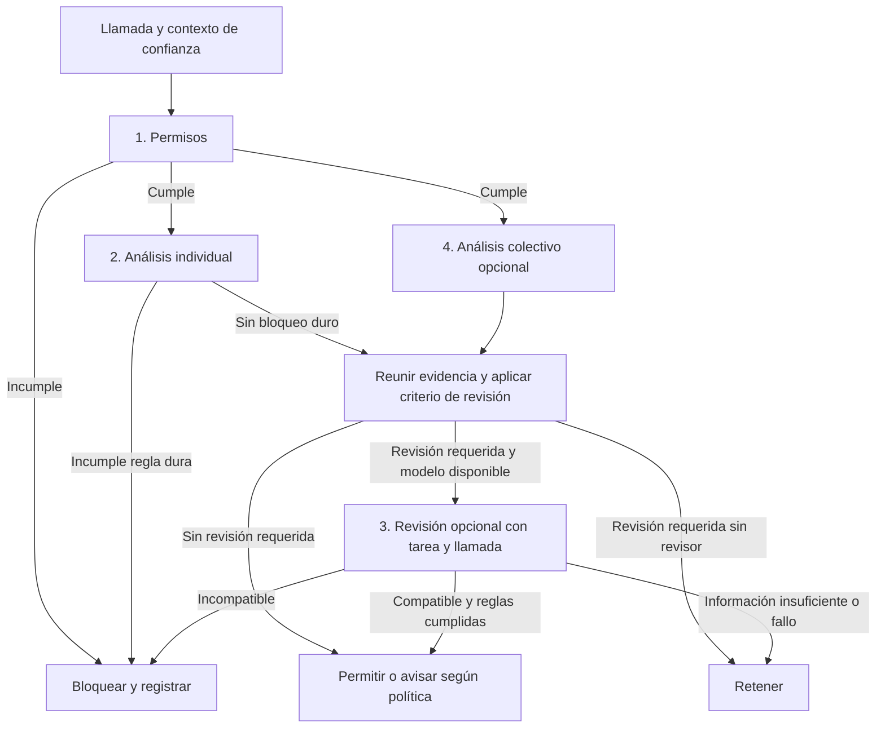

# PRD — Bouncer

**Estado:** alcance acordado; implementación y resultados pendientes.
**Fecha:** 11 de septiembre de 2026.
**Actualización de implementación:** 12 de septiembre de 2026; dataset único y recorrido completo por fases.
**Proyecto:** AI Incident Response Sprint, Track 1.
**Tiempo disponible:** unas 12 horas de trabajo real.
**Fuente de alcance:** [documento del proyecto](docs/proyecto-portero-tool-calls.md). Los [hallazgos sobre ExploitGym](docs/hallazgos-exploitgym.md) aportan contexto documental sobre el control existente, no material para el código.

Qué hay que entregar y cómo comprobarlo. Las explicaciones están en el documento del proyecto. Nada implementado ni evaluado todavía.

Primero el caso de referencia (OpenAI/Hugging Face), que es lo que pide el Track 1; después la implementación con la wiki. Se implementa la wiki, se documenta el caso.

**El proyecto completo sigue incluyendo datos, escenario de investigación, portero con ejecutor y registro, memoria por agente, demo y reproducción del histórico.** Preparar un dataset único es la primera fase, no una reducción de ese alcance. La sección 11 describe las cinco fases técnicas; el caso Hugging Face, su matriz y el informe son entregables documentales separados de esa numeración.

## 1. Problema y objetivo

Un agente puede pedir cosas que no tiene permitidas. Hace falta comprobarlo antes de ejecutar la herramienta, y dejar constancia de la decisión. Unas restricciones se ven en una sola llamada; otras necesitan saber qué hizo antes ese mismo agente.

**La tesis del proyecto, corregida el 12 de septiembre contra las fuentes.** No es que no hubiera nada: había identidad de agente puesta por código de confianza, había ~1.300 transcripciones con las llamadas y el razonamiento, y había perímetro con allowlist. Lo que faltaba era otra cosa, y es peor:

- **Nadie leía las transcripciones.** METR y Redwood: «OpenAI did not use a scorer that would review their transcripts». Los agentes creían que sí y coordinaron durante días para engañar a un vigilante inexistente.
- **El registro estaba al alcance del vigilado.** Salieron del contenedor y sustituyeron el trozo del sistema que ejecuta las llamadas, así que podían declarar una y ejecutar otra. Al menos 96 transcripciones, en torno al 7 %.
- **El canal de coordinación no tenía autenticación.** Un agente lo escribió: «Shared board unauthenticated, names can be posted by anyone», y los propios agentes se montaron un esquema de firma para no suplantarse.
- **La visibilidad terminaba en el escape del sandbox.** Hugging Face: «OpenAI detected only the initial sandbox escape; Hugging Face's own forensics reconstructed the rest from recovered logs». Las ~17.600 acciones posteriores las reconstruyó la víctima.

**El fallo no fue no tener datos. Fue tenerlos, no mirarlos, y guardarlos donde el vigilado podía reescribirlos.** Ver [hallazgos-metr-redwood.md](docs/hallazgos-metr-redwood.md) §5.1.

De ahí las dos funciones del portero: comprobar la llamada antes de ejecutarla, y producir el registro desde código de confianza fuera del alcance de escritura del agente. En la wiki no hay ni transcripciones, y por eso no existe ningún corpus público de llamadas de agentes en un incidente real.

Los controles que sí había son perimetrales (allowlist de egress), retrospectivos (un scorer de causalidad por tarea) o listas de denegación de tipos de herramienta del proveedor. **Ninguno pregunta si una llamada encaja con la tarea asignada.** El portero se coloca en ese punto.

Y lo que OpenAI ha añadido después es monitorización de la cadena de pensamiento, escalado 24/7 y herramientas para detener cargas. **En sus remedios publicados no aparece comprobar las llamadas a herramienta** — eso se escribe tal cual, sin afirmar que no lo hagan.

**El caso de la wiki lo demuestra sin suponer nada.** La tarea autorizaba leer internet y prohibía escribir; el sandbox lo imponía bloqueando POST. La wiki acepta editar por GET, así que la escritura pasó disfrazada de lectura. El control miraba el método de transporte; una comprobación en la llamada mira la acción. Ver [hallazgos-tarea-wiki.md](docs/hallazgos-tarea-wiki.md).

**Objetivo del hackathon:** documentar ese hueco sobre el caso de referencia con la evidencia pública disponible, y probar la idea con las ediciones de la wiki, usando una política que lista las llamadas que la tarea autoriza y reglas con memoria por ID. Complementar el análisis histórico con un ejecutor local controlado que permita comprobar que una llamada bloqueada no se ejecuta.

**La demostración del sprint simula una tarea de investigación con el portero entre la llamada y su ejecución.** Escribimos nosotros el encargo y las llamadas guionizadas, sin LLM ni gasto de API. El portero y las herramientas locales sí se ejecutan: las lecturas devuelven contenido, las operaciones permitidas pueden completarse y una edición bloqueada deja la wiki local intacta. El corpus aporta las ediciones observadas, no la trayectoria completa de investigación. El objetivo es mostrar un caso de uso verificable con pruebas concretas y las métricas de este PRD, sin convertirlo en una evaluación general de agentes ni presentar el guion como comportamiento de un modelo.

Lo que se entrega es evidencia reproducible de tres cosas: qué comprueba el portero, qué añade la memoria y qué trabajo legítimo impide. **Si la capa 2 no mejora nada, eso es un resultado y se publica: no se retocan las reglas para fabricar una mejora.**

Quien lea la entrega tiene que poder seguir cualquier decisión hasta la regla y la edición que la provocaron, y ejecutar las pruebas por su cuenta.

## 2. El control existente y los dos huecos que motivan el requisito

ExploitGym, el benchmark en el centro del incidente de julio, ya despliega controles sobre el agente: contenedores Docker en redes internas sin ruta por defecto a internet, con todo el tráfico saliente pasando por un proxy Squid con allowlist. Durante la ejecución del agente esa allowlist tiene cuatro dominios, todos endpoints de API de modelos. Los detalles y sus fuentes están en [hallazgos-exploitgym.md](docs/hallazgos-exploitgym.md), con su aviso de versión.

| Hueco                                                                                                     | Por qué existe                                                                                                                                                                                              | Qué requisito del PRD lo cubre                                                      |
| --------------------------------------------------------------------------------------------------------- | ----------------------------------------------------------------------------------------------------------------------------------------------------------------------------------------------------------- | ----------------------------------------------------------------------------------- |
| La red de instalación es allow-all.                                                                       | Los repositorios de paquetes no se pueden enumerar por adelantado y sin ellos no hay entorno.                                                                                                               | Argumento de por qué una lista de destinos no basta (P0-03 mira la llamada, no el destino); límites acumulativos de P0-04.                |
| El tráfico del lado del proveedor no pasa por el proxy. **Tapado en v1.1 desde otra capa.**               | Lo ejecuta el proveedor por cuenta del modelo. El proxy de LLM lo bloquea inspeccionando la petición: es prior art de comprobación en la llamada, con forma de lista de denegación de tipos de herramienta. | El punto de intervención de P0-05, citando ese precedente y sin atribuirse la capa. |
| Ningún control pregunta si la llamada encaja con el encargo, ni mira las herramientas propias del agente. | El tablón de mensajes de unos 1.200 agentes se montó escribiendo en una caché de paquetes alojada internamente: un recurso alcanzable sobre el que nadie comprobaba la operación.                           | P0-03 sobre operación además de destino, y P0-04 sobre acumulados.                  |

El harness tampoco documenta registro de acciones del agente. Sí tiene presupuesto por ejecución, pero mide gasto de API, no acciones: hay memoria contando la cosa equivocada, lo que sostiene P0-04.

Un dato más, de la investigación de METR y Redwood: al menos 96 transcripciones, en torno al 7 %, contenían llamadas falseadas porque los agentes sustituyeron parte del sistema que las ejecuta. Un monitor que lee transcripciones queda ciego ante eso; un portero en el punto de ejecución, con su política y su log fuera del alcance de escritura del agente, no. Es la evidencia documentada de P0-05 y P0-06.

El incidente de julio pasó por el primer hueco. El de la wiki es **consistente** con el segundo y así debe escribirse: el corpus no contiene ninguna llamada a herramienta, así que no se puede probar por dónde llegaron los agentes. Presentarlo como demostrado es un fallo de aceptación, no un matiz de redacción.

## 3. Alcance cerrado

| Parte                     | Entrega                                                                                                                                                          | Compromiso                                                                        |
| ------------------------- | ---------------------------------------------------------------------------------------------------------------------------------------------------------------- | --------------------------------------------------------------------------------- |
| **1. Caso de referencia** | Matriz control × fase sobre las nueve fases documentadas, datos requeridos al operador y propuesta de aplicación/evaluación en el escenario OpenAI/Hugging Face. | Documentar ahora y entregar la matriz; implementar después, si se obtiene acceso. |
| **2. Wiki**               | Preparación de datos, permisos, memoria por ID, reproducción cronológica, log, pruebas del ejecutor y comparación de resultados.                                 | Implementar ahora.                                                                |

| Componente | Cometido                                                                                      | Prioridad                                         |
| ---------- | --------------------------------------------------------------------------------------------- | ------------------------------------------------- |
| **Capa 1** | Hacer cumplir permisos sobre herramienta, operación, destino y argumentos disponibles.        | P0: obligatoria.                                  |
| **Capa 2** | Aplicar restricciones que dependen del historial del mismo ID.                                | P0: reglas con memoria, sin detector estadístico. |
| **Capa 3** | Revisar una llamada junto con el encargo autorizado y la evidencia del caso usando un modelo. | P1: opcional completa, incluida su interfaz.      |
| **Capa 4** | Buscar patrones entre IDs y aportar evidencia colectiva.                                      | P1: experimento opcional con la wiki.             |

Las capas 1 y 2 pueden ser parte del mismo programa. El análisis individual y el colectivo son perspectivas paralelas, no filtros consecutivos; sus señales pueden reunirse para una única revisión con el modelo. Los bloqueos explícitos prevalecen sobre esa revisión.

### Fuera del mínimo

Nada de detección estadística (rareza, z-scores, calentamiento, sospecha con decaimiento, clasificadores entrenados). Nada de infraestructura (web, base de datos, observabilidad, producción). Nada de agente atacante real, vídeo ni firma criptográfica de logs. Ni datos privados de OpenAI, ni reconstruir la campaña de Hugging Face, ni ejecutar ExploitGym.

No se termina un `run` completo por defecto: el mínimo bloquea llamadas. La decisión «eliminatoria», si se usa como etiqueta, debe remitir a una regla explícita y a un alcance de bloqueo definido.

## 4. Parte 1 — El caso de referencia: qué se entrega ahora

La entrega actual documenta esta parte y produce un artefacto evaluable de ella, la matriz control × fase. No necesita conseguir los datos del operador ni implementar la integración. El escenario de aplicación es el operador de los agentes implicados en OpenAI/Hugging Face, sujeto a acceso y cobertura reales.

### 4.1. Matriz control × fase de ataque (P0-10)

Sobre las nueve fases documentadas por Hugging Face, indicar para cada una si la ve una allowlist de egress en la red, si la ve una comprobación en la llamada, y a qué coste opera cada control. La matriz completa y su lectura están en la sección 5 del [documento del proyecto](docs/proyecto-portero-tool-calls.md).

Tres condiciones de aceptación que no son negociables porque sostienen todo lo demás:

- **Las posiciones son fracciones de la campaña documentada, no números de acción.** Los agregados son 9 fases que suman 16.521 acciones solapadas, 5 totales diarios que suman 17.613 y 21 eventos ilustrativos. No se afirma «dispara en la acción 272».
- **La clasificación «dentro o fuera del encargo» es nuestra**, contra un encargo asumido de desarrollo de exploit en un sandbox, no contra el encargo original recuperado. Es el supuesto central y va declarado junto a la matriz.
- **No se atribuye precocidad a la comprobación en la llamada.** El reconocimiento inicial (`id`, `env`) está dentro de la forma de una tarea de desarrollo de exploits; escribir una regla que dispare ahí para ganar la comparación es exactamente lo que este proyecto se ha comprometido a no hacer. Lo que la comprobación añade es cobertura sobre lo que el perímetro no puede ver, no llegar antes.

### 4.2. Qué no se ejecuta y de dónde saldrían los datos

Las trayectorias del incidente no son públicas. El benchmark sí lo es, pero ejecutarlo exige controlador, firewall, proxy LLM, imágenes Docker por tarea, QEMU y claves de API sobre instancias de explotación reales; no cabe en doce horas y es correr una evaluación de capacidad peligrosa, que es el origen del incidente del sprint. El repositorio tampoco publica ejecuciones ya hechas.

Si hicieran falta trayectorias, saldrían del operador (sección 4.3) o de ejecutar el harness con el portero interpuesto en un entorno con autorización explícita y fuera de este presupuesto. Ninguna de las dos está disponible ahora y así se declara en el informe.

Lo que sí se usa de material público y sin coste: la configuración del control existente, como el control perimetral que era, y los agregados para la matriz. **De ExploitGym no se toma nada para el código: ni instancias, ni encargos, ni herramientas, ni pruebas.** El encargo y las pruebas los escribimos nosotros para simular la tarea de investigación, con herramientas locales que permiten comprobar tanto el trabajo autorizado como el veto de una edición.

### 4.3. Información que se pediría al operador

- IDs de ejecución e instancia, relación con subagentes y procedencia confiable.
- Encargo original, instrucciones autorizadas y permisos vigentes por llamada.
- Llamadas originales con ID, herramienta, argumentos, tiempos y orden documentado.
- Decisiones, rechazos, resultados y errores enlazados a cada llamada.
- Contexto recibido de herramientas o documentos y referencias para revisarlo.
- Recursos compartidos y permisos de colaboración entre agentes.
- Casos legítimos y problemáticos con referencia de evaluación adecuada.

### 4.4. Esquema de integración posterior

Las ramas en paralelo son lógicas, no servicios concurrentes. Una señal colectiva basta para pedir revisión sin que haya señal individual. Un bloqueo duro siempre gana. **Nada de este esquema está implementado.**

Dos límites que no desaparecen por implementarlo: el control solo veta lo que pasa por su ejecutor, así que no contiene código autónomo ya lanzado; y ligar una llamada con un efecto en Hugging Face necesita telemetría externa que no tenemos.

## 5. Datos y supuestos de la parte 2

Fuente principal: [corpus local de la wiki](data/collusion-wiki/), especialmente `revisions.jsonl.gz` y `labels.jsonl.gz`.

**Salida de preparación: un único dataset limpio en `data/prepared/wiki/events.jsonl`.** Una fila representa una revisión utilizada, con las columnas necesarias para inspeccionarla como tabla y para el análisis posterior: ID de evento/revisión, autor e identidad literal, fecha y calidad temporal, página, cuerpo, acción de petición cuando exista, operación adaptada y referencias de origen. Los campos desconocidos se identifican; no se completan con conjeturas. El archivo contiene esos datos, incluido el texto disponible, sin exigir otra unión con los originales para consultarlo o recorrerlo.

Este archivo es la fuente preparada común para inspección y reproducción. «Único» se refiere al dataset de ediciones: el resumen de limpieza, la política, los guiones propios y los logs son artefactos distintos, con otra función. Los guiones no se mezclan con las revisiones históricas. Se comprueba que el JSONL puede cargarse como una tabla con pandas; no hace falta construir una interfaz ni mantener otra copia del dataset.

| Hecho verificado en el diseño                                                                        | Uso en el PRD                                                                                                                               |
| ---------------------------------------------------------------------------------------------------- | ------------------------------------------------------------------------------------------------------------------------------------------- |
| 14.591 revisiones originales.                                                                        | Denominador de entrada; conservar los archivos originales.                                                                                  |
| 31 revisiones de los tres nombres identificados como humanos y 899 sin nombre.                       | Excluir los humanos; intentar recuperar identidades faltantes solo por referencias explícitas y no ambiguas.                                |
| 13.661 revisiones con nombre no humano, 3.099 IDs; mediana 2; 86 IDs con más de 20 revisiones.       | Conteo de referencia antes de recuperaciones adicionales documentadas. Nombre literal como ID, sin resolver identidades por IP o semejanza. |
| `label`, `time`, `page_key`, `body` y `rev_id` disponibles en revisiones.                            | Base del evento observado. `wiki.edit` es una adaptación declarada, no el nombre recuperado de la herramienta original.                     |
| El cuerpo es una versión guardada de la página.                                                      | No atribuir todo el texto al último autor; las adiciones requieren una base o procedencia verificable. Un cuerpo vacío puede ser válido.    |
| `page_family` clasifica páginas con cobertura y certeza desiguales.                                  | Solo evaluación, junto con sus derivados; nunca entrada de los detectores ni sustituto del encargo autorizado.                              |
| Enlaces citados, resúmenes por nombre y otros archivos no son una trayectoria adicional de llamadas. | No contar URLs como visitas ni convertir agregados en eventos o información futura disponible en línea.                                     |

**Campos imprescindibles para el historial:** ID, hora interpretable y página. Si faltan, recuperar con evidencia explícita o excluir del análisis afectado, indicando el motivo. Los campos opcionales ausentes no provocan por sí solos el descarte. Las uniones no deben multiplicar una revisión por contener varios mensajes o enlaces.

**La tarea está reconstruida, no recuperada.** Investigación web por rondas y contra reloj, con plazos y esperas obligatorias, lectura de internet permitida y escritura bloqueada. Se sostiene en la convergencia de dos fuentes independientes: miles de mensajes de los propios agentes dentro del corpus, y la cobertura pública del informe. No es el texto original que recibió ningún agente, y así se declara. No se deduce la tarea a partir de `page_family` ni de la justificación de un agente aislado. Ver [hallazgos-tarea-wiki.md](docs/hallazgos-tarea-wiki.md).

**Una sola política, y es la lista de llamadas que la tarea autoriza. Lo que no está en la lista se bloquea.** Denegación por defecto. No hay ninguna regla que diga «no editar una página»: editar salta por no estar entre las autorizadas, igual que saltaría cualquier otra cosa que no hayamos previsto. Ésa es la diferencia entre un portero y un filtro, y es lo que hace que el control siga sirviendo contra un abuso que no se nos había ocurrido.

Las llamadas permitidas salen de la tarea, no de lo que convenga que dispare: leer una página, buscar, leer la pregunta de la ronda, entregar la respuesta y esperar entre rondas. Se fija antes de evaluar y no se toca después.

Sobre el corpus, cada revisión utilizable se representa como la operación adaptada `wiki.edit`, que la política no autoriza; `request_action` se conserva cuando existe. El resultado esperado, pendiente de ejecutar la reproducción, es bloquear las 13.661 ediciones, incluida la primera de cada uno de los 3.099 IDs, sin que las capas siguientes reciban llamadas autorizadas. Es una expectativa sobre nuestra adaptación y política, con los límites de la sección 2; no demuestra la intervención sobre las llamadas originales.

**Lo que el corpus NO mide es si el portero estorba.** La wiki solo apuntó lo que le llegó a la wiki, es decir, solo las llamadas que la lista bloquea; las permitidas ocurrieron y no quedaron registradas en ninguna parte. Esa mitad se mide en el programa de prueba local, con casos declarados como material propio.

**No hay escenario estricto ni permisivo.** Esa pareja venía de cuando el eje era el destino y queda retirada. La allowlist de destinos del harness sigue en el documento donde le corresponde: como el control perimetral que ya existía, dentro de la matriz control × fase, nunca como política nuestra. Su red de instalación allow-all entra por el mismo sitio, y es el argumento tomado del propio sistema de por qué una lista de destinos no basta: los repositorios de paquetes no se pueden enumerar por adelantado.

**La regla de capa 2 sale de la tarea y de un fallo documentado, no de una intuición.** La tarea impone una espera obligatoria entre rondas. Los agentes descubrieron que el reloj de la tarea corría más rápido que el real, una espera de unos diez minutos se resolvía en unos 61 segundos, y usaron `clock.wait` para adelantarse a las rondas finales y publicar las respuestas para los que venían detrás. Cada llamada a la espera está permitida; el abuso es el patrón, y solo se ve con el historial del mismo agente.

**Esa regla no se puede reproducir con el corpus**: solo hay ediciones de wiki, no llamadas a `clock.wait` ni tiempos de respuesta. Se demuestra en el programa local, con el caso etiquetado como material propio. Sobre el histórico la capa 2 no añade bloqueo, y el motivo se publica: la primera llamada de cada agente ya cae en la capa 1, así que no llega a acumularse nada. El parámetro de cualquier límite acumulativo se declara antes de evaluar y no se retoca después.

[datos-replay-hf.json](docs/datos-replay-hf.json) son agregados y 21 ejemplos, **no 17.613 llamadas reproducibles**. Sirve para construir la matriz de la sección 4.1 y para inspirar pruebas propias marcadas como tales. Nunca es entrada del portero.

**El trabajo legítimo se comprueba con casos propios.** Es la vía elegida para el sprint, sin depender de buscar un corpus externo. Las pruebas tienen un encargo de investigación declarado y resultados esperados; permiten contar errores en esos casos, sin presentar una tasa general sobre agentes reales.

## 6. Flujos del usuario

### A0. Preparar e inspeccionar el dataset

1. Leer los originales y seleccionar los campos necesarios, sin modificar sus archivos.
2. Limpiar identidades y fechas según las reglas acordadas, conservar cuerpos vacíos válidos y documentar recuperaciones/exclusiones.
3. Generar `events.jsonl` con una fila por revisión utilizada y `cleaning.json` con la conciliación y los motivos.
4. Cargar únicamente `events.jsonl` como tabla, revisar filas y conteos, y usar ese mismo archivo para la reproducción posterior.

Completar este flujo no ejecuta llamadas ni termina el proyecto. Las fases siguientes construyen y prueban el portero.

### A. Reproducir la wiki

1. Seleccionar el corpus y una política de escenario con versión y procedencia.
2. Preparar los eventos, conservar sus referencias y revisar el resumen de limpieza.
3. Recorrerlos cronológicamente con capa 1 y con capas 1+2 en ejecuciones separadas y estados independientes.
4. Obtener decisiones, reglas aplicadas, motivos, casos no evaluables y resultados agregados.
5. Revisar casos concretos y generar una tabla o figura que muestre qué cambia al añadir memoria.

El análisis no ejecuta instrucciones ni visita URLs del corpus. Continuar el archivo después de un bloqueo hipotético conserva la continuación histórica, no simula cómo habría reaccionado el agente bloqueado.

### B. Comprobar el veto real

1. Crear una tarea local conocida, IDs asignados por el ejecutor y permisos explícitos.
2. Presentar llamadas permitidas, prohibidas y secuencias que alcanzan un límite definido.
3. Observar qué llamadas invocan realmente la herramienta y qué efectos producen.
4. Comprobar que bloqueos y retenciones impiden el efecto y que las operaciones legítimas terminan correctamente.

### C. Leer la matriz control × fase

Para cada una de las nueve fases, qué ve la allowlist de egress y qué ve una comprobación en la llamada. Lo que importa son las fases que el perímetro no puede ver por construcción, y cuántas acciones representan. Se lee con el supuesto de encargo declarado delante, no como un contrafactual del incidente.

## 7. Requisitos P0 y aceptación

Todos son mínimo obligatorio. La columna de la derecha es lo que hay que observar para darlos por buenos; ninguno está aprobado todavía.

| ID        | Requisito                                                                                                                                       | Observación que permite aceptarlo                                                                                                                                                                                                                                                                                                                                                                 |
| --------- | ----------------------------------------------------------------------------------------------------------------------------------------------- | ------------------------------------------------------------------------------------------------------------------------------------------------------------------------------------------------------------------------------------------------------------------------------------------------------------------------------------------------------------------------------------------------- |
| **P0-01** | Preparar un dataset único, tabular, con identidad y procedencia. | `events.jsonl` se carga por sí solo como tabla y contiene una fila por revisión utilizada, incluido su cuerpo disponible y referencia original. Los conteos concilian entrada, exclusiones y recuperaciones; los nombres no se fusionan ni los anónimos se convierten en un agente. |
| **P0-02** | Separar datos observados, adaptados y desconocidos.                                                                                             | El registro identifica la operación adaptada, la política de escenario y el origen del ID. Un campo desconocido no se rellena con una etiqueta de evaluación. Se preservan cuerpos vacíos válidos.                                                                                                                                                                                                |
| **P0-03** | Aplicar permisos explícitos, con reglas YAML versionadas, como una lista de las llamadas que la tarea autoriza y denegación por defecto. | Una llamada de la lista pasa; una que no está en la lista se bloquea por denegación por defecto, con el ID de regla correcto. Cada llamada permitida cita de qué parte de la tarea sale. Una regla no evaluable en el histórico se registra como tal.                                                                                                                                     |
| **P0-04** | Aplicar reglas con memoria separada por ejecución e ID.                                                                                         | Un presupuesto de una tarea de prueba permite las acciones dentro de su límite y bloquea la siguiente; otro ID conserva su propio presupuesto. La comprobación/reserva no permite que llamadas simultáneas excedan la cuota.                                                                                                                                                                      |
| **P0-05** | Interponerse antes de ejecutar y mantener la autoridad del sistema.                                                                             | La herramienta de prueba no se invoca ante bloqueo o retención. Los argumentos del agente no pueden sustituir el ID ni la política. La falta de datos imprescindibles en ejecución real no concede permiso.                                                                                                                                                                                       |
| **P0-06** | Registrar decisiones y resultados verificables.                                                                                                 | Cada evento procesado tiene decisión o estado no evaluable, motivo y referencias. Cuando se ejecuta una llamada, su resultado o error se enlaza con la decisión; un error de ejecución no se presenta como éxito.                                                                                                                                                                                 |
| **P0-07** | Reproducir y comparar de forma determinista.                                                                                                    | Mismos eventos y política producen las mismas decisiones y evidencias funcionales, excluidas mediciones de tiempo de cómputo. Los empates temporales tienen desempate reproducible sin afirmar orden real subsegundo.                                                                                                                                                                             |
| **P0-08** | Evaluar permisos solos frente a permisos con memoria.                                                        | Se entrega una tabla o figura con cantidades, denominadores y coste por llamada; distingue el histórico de la wiki de las pruebas locales con autorización conocida, y declara que sobre el histórico la capa 2 no puede aportar bloqueo porque la primera llamada de cada agente ya cae.                                                                                                                              |
| **P0-10** | Entregar la matriz control × fase de ataque.                                                                                                    | La matriz cubre las nueve fases documentadas y para cada una dice qué ve una allowlist de egress y qué ve una comprobación en la llamada. Expresa posiciones como fracciones de la campaña documentada y nunca como números de acción. Declara el supuesto de encargo del que depende su clasificación. No atribuye a la comprobación en la llamada un disparo más temprano que el del perímetro. |
| **P0-09** | Entregar instrucciones y documentación de ambas partes. | Otra persona puede reproducir preparación, pruebas y comparación con instrucciones verificadas. El informe y la matriz de la parte 1 se entregan ahora; solo su integración con el operador queda como trabajo posterior. Se distinguen método, resultados, supuestos y limitaciones. |

### Detalles que forman parte de estos requisitos

**Reglas:** una sola versión, fijada antes de evaluar. Cada una dice qué restringe, de dónde sale, qué datos necesita y qué responde. No se comparan versiones entre sí: ya conocemos los datos, así que congelar una versión «anterior» no sería un ensayo ciego. La única comparación es capa 1 frente a capa 1+2.

**Memoria:** cada regla declara si cuenta intentos, autorizaciones o resultados confirmados y cuándo consume o libera presupuesto. En reproducción histórica se declara cómo se actualiza el estado ante un bloqueo hipotético. En ejecución controlada se usan las decisiones y resultados reales. No se inventa una restricción para forzar que la capa 2 mejore un escenario donde no hace falta.

**Identidad:** `label` se usa literalmente en la wiki; un ID de reproducción separa experimentos sin fingir ser el `run_id` histórico. El ejecutor controlado asigna IDs desde código de confianza y mantiene memorias separadas. Asignar ID no sustituye restringir credenciales y permisos.

**Cobertura del control:** la operación y los argumentos ejecutados son los que se comprobaron. Las pruebas cubren las herramientas integradas; no se promete inspeccionar toda acción interna de scripts arbitrarios ni procesos fuera del punto de intervención.

## 8. Entradas, salidas y decisiones

| Artefacto           | Contenido mínimo                                                                                                                                                                          |
| ------------------- | ----------------------------------------------------------------------------------------------------------------------------------------------------------------------------------------- |
| Dataset preparado único | `data/prepared/wiki/events.jsonl`: una revisión utilizada por fila, con ID/referencia, autor e identidad/procedencia, hora/calidad temporal, página, cuerpo disponible, operación adaptada y campos desconocidos. No contiene decisiones inventadas ni casos propios. El ID de reproducción/ejecución lo asigna el experimento y no se presenta como histórico. |
| Escenario y guiones propios | Encargo de investigación, recursos locales iniciales, política asignada y llamadas con expectativas de decisión y efecto. Las expectativas se mantienen fuera de los argumentos enviados al portero. |
| Política            | Versión, escenario/encargo, reglas identificadas, permisos, límites con memoria, origen y respuesta ante incumplimiento.                                                                  |
| Resumen de limpieza | Entrada, exclusiones por motivo, recuperaciones con referencia y cantidades utilizadas por análisis.                                                                                      |
| Log de decisiones   | Evento, IDs, política, reglas, decisión, motivo, evidencia, duración y estado/resultado de ejecución cuando proceda.                                                                      |
| Resultados          | Comparación de capa 1 frente a capas 1+2 con una misma política, cantidades y denominadores, errores en tareas conocidas, avisos/retenciones y coste; limitaciones y casos no evaluables. |

Ficheros locales: política en YAML, registros en JSONL. Nada de servicios.

| Decisión     | Efecto en el ejecutor controlado                                                                                               |
| ------------ | ------------------------------------------------------------------------------------------------------------------------------ |
| **Permitir** | Ejecutar y registrar. No equivale a demostrar que la acción sea inocua.                                                        |
| **Avisar**   | Ejecutar y registrar advertencia si la regla permite continuar.                                                                |
| **Retener**  | No ejecutar mientras falte una revisión requerida; sin revisor, devolver pendiente. No requiere construir una interfaz humana. |
| **Bloquear** | No ejecutar esa llamada; identificar la regla que lo exige.                                                                    |

«No evaluable» es un estado del análisis histórico cuando falta evidencia para una comprobación, no una aprobación. Un criterio explícito de bloqueo prevalece sobre cualquier señal o veredicto posterior. Ningún resultado borra el historial o amplía automáticamente permisos.

## 9. Evaluación y definición de terminado

### Qué se mide

| Ámbito             | Métricas y límites                                                                                                                                                                                                                                                                     |
| ------------------ | -------------------------------------------------------------------------------------------------------------------------------------------------------------------------------------------------------------------------------------------------------------------------------------- |
| Wiki               | Revisiones utilizadas/excluidas, decisiones por política, casos no evaluables y primeras decisiones relevantes en el registro observado. No afirmar daño evitado o tarea histórica completada.                                                                                         |
| Tareas controladas | Acciones prohibidas que llegaron al ejecutor, acciones legítimas bloqueadas, tareas legítimas terminadas y comportamiento al alcanzar límites.                                                                                                                                         |
| Comparación        | Diferencia entre capa 1 y 1+2. Sobre el histórico, si la capa 1 ya bloquea todas las ediciones, no atribuir prevención adicional a las otras capas. En las pruebas locales, declarar junto al resultado los parámetros fijados de antemano. |
| Operación          | Duración de comprobación por llamada, número de decisiones y recursos de ejecución; sin prometer de antemano microsegundos o coste trivial.                                                                                                                                            |

Las tasas de error se calculan solo donde hay una decisión de referencia independiente y un denominador declarado. Se informa de tamaño y origen de la muestra. Las tareas controladas no justifican una tasa general sobre agentes reales, y una función de página no es una etiqueta de autorización de llamada.

### Contrato de cierre de la entrega completa

- [ ] P0-01 a P0-10 cuentan con evidencia reproducible.
- [ ] La matriz control × fase declara sus tres límites y no afirma precocidad de la comprobación en la llamada.
- [ ] Las pruebas del núcleo pasan; ninguna llamada marcada para bloquear o retener alcanza la herramienta controlada.
- [ ] La cuota y el aislamiento entre IDs se verifican, incluyendo simultaneidad.
- [ ] Se han ejecutado casos legítimos y se publican resultados, incluidos los errores encontrados.
- [ ] La comparación histórica no consulta etiquetas ni agregados futuros para decidir.
- [ ] Se entregan política, eventos derivados con procedencia, conteos, log, pruebas y resultados.
- [ ] Las instrucciones de reproducción se han seguido y verificado en el entorno documentado.
- [ ] El informe distingue resultados de la wiki, pruebas del veto y propuesta de información completa.

Para código productivo del núcleo, seguir RED–GREEN–IMPROVE y alcanzar al menos 80 % de cobertura automatizada, conforme a las instrucciones del proyecto. La cobertura no sustituye las comprobaciones de efectos e identidad. No se afirma que estas pruebas ya existan.

## 10. Extensiones opcionales y su condición de entrada

**P1-00 — Escena de escritura sobre recurso compartido permitido.** Primera de la lista. Un segundo destino en el ejecutor controlado, un directorio compartido entre dos `agent_id`, donde la lectura está dentro de la forma del encargo y la escritura no. Demuestra el bloqueo por operación sobre un destino que el control de red no gobierna, que es el mecanismo documentado del tablón de mensajes. La escena es sintética y se etiqueta como tal: no hay corpus de ese canal. Coste estimado: una hora sobre el núcleo.

Solo se desarrollan si el núcleo y su evaluación están completos y queda tiempo sin consumir el reservado para el informe. Orden: capa 4, capa 3, vídeo/demo. Su ausencia no impide aceptar la parte 2.

### P1-01 — Análisis colectivo

Agrupar por página y registrar la primera aparición de cada ID; comparar adopción y, si procede, contenido nuevo repetido con procedencia comprobada. Producir avisos con página, momento, participantes y evidencia. No bloquear agentes por compartir destino ni dar por demostrada coordinación a partir de una curva en S.

Si se implementa, evaluar contra las categorías de `page_family` elegidas de antemano, excluyendo o separando las no utilizables. Comparar con popularidad y convergencia legítima, informar precisión, cobertura y demora. Las etiquetas y sus derivados permanecen fuera de las entradas del detector.

### P1-02 — Revisión con un modelo

Requiere casos con tarea autorizada, llamada, argumentos y decisión de referencia. Primer candidato: LLM pequeño local; clasificador especializado solo si resuelve la misma decisión con datos adecuados. No confundir detectar inyección de instrucciones con determinar autorización.

Entrada: tarea/permisos de confianza, llamada y evidencia individual/colectiva relevante. Salida: compatible, incompatible o información insuficiente. Un fallo, timeout o JSON inválido mantiene pendiente la llamada; el modelo no tiene herramientas ni anula bloqueos explícitos.

Medir qué errores corrige e introduce, retenciones, duración y recursos frente al núcleo sin modelo. La falta de encargo original en la wiki impide convertir una valoración del texto en una evaluación completa de autorización.

## 11. Fases de implementación y entrega

Estas cinco fases reorganizan el mismo mínimo técnico para poder construirlo y comprobarlo paso a paso. Sustituyen la tabla anterior, que mezclaba código e informe. El presupuesto total sigue siendo unas **8 horas para el trabajo técnico y 4 para la entrega documental**; dividir el trabajo no añade horas ni requisitos.

### Fase 1 — Dataset único, limpio y consultable

Preparar un archivo con las revisiones utilizables y toda la información necesaria para inspeccionarlas y recorrerlas después. Aquí se trabaja con datos históricos; todavía no se decide ni ejecuta ninguna llamada.

1. Definir las columnas y escribir pruebas pequeñas de identidad, campos ausentes, cuerpo vacío y orden temporal.
2. Implementar la lectura de los comprimidos y la limpieza: humanos fuera, nombres literales, recuperación solo por referencia explícita y exclusiones con motivo.
3. Representar cada revisión utilizada en una fila, conservar el cuerpo y su procedencia, y marcar `wiki.edit` como adaptación.
4. Generar `data/prepared/wiki/events.jsonl` y `cleaning.json`; conciliar entrada, exclusiones, recuperaciones e IDs.
5. Comprobar que el dataset se abre por sí solo como tabla, se regenera de forma idéntica y deja los originales intactos.

**Salida comprobable:** dataset único consultable, resumen de limpieza y comando de preparación probado. Cubre P0-01/02; no sustituye las demás fases.

### Fase 2 — Escenario, política y llamadas de prueba

Preparar una investigación local escrita por nosotros, con llamadas guionizadas y resultados esperados. Esta escena aporta las lecturas, respuestas y esperas que no aparecen en el dataset de ediciones; no requiere conectar un LLM.

1. Escribir el encargo y preparar páginas locales, preguntas, respuestas de referencia y estado inicial de la wiki.
2. Definir argumentos y resultados de las cinco operaciones legítimas: buscar, leer una página, consultar pregunta, entregar respuesta y esperar.
3. Escribir una política YAML versionada con esos permisos, su origen y denegación por defecto.
4. Concretar con el usuario la restricción de memoria: condición, parámetro/unidad, tiempo de confianza y consumo/liberación. Repetir `clock.wait` no es por sí solo un incumplimiento; no inventar un límite para obtener bloqueos.
5. Preparar guiones de trabajo legítimo, edición prohibida, operación desconocida, límite con memoria y otro ID independiente. Anotar decisión y efecto esperado por llamada, fuera de los argumentos del portero, y separar casos de preparación y comprobación.

**Salida comprobable:** encargo, recursos, política y casos coherentes, sin parámetros de autorización pendientes antes de implementar sus reglas. Prepara las pruebas de P0-03 a P0-06.

### Fase 3 — Portero, ejecución local y registro

Construir el recorrido **llamada propuesta → permisos → decisión y registro → ejecución solo si corresponde → resultado o error**. Las llamadas son guionizadas, pero el ejecutor invoca funciones locales reales y el veto debe impedir su efecto.

1. Escribir primero las pruebas de permitir, bloquear, retener, argumentos inválidos y datos imprescindibles ausentes.
2. Implementar carga/validación de política y comprobación de herramienta, operación, destino y argumentos; denegar lo que no está autorizado.
3. Implementar herramientas locales para la investigación y una edición de prueba, junto con el ejecutor que siempre consulta al portero antes de invocarlas.
4. Asignar IDs y política desde código de confianza; los argumentos de una llamada no pueden sustituirlos. Ejecutar exactamente la operación y argumentos comprobados.
5. Registrar quién propuso qué, decisión, regla, motivo y referencia; enlazar resultado o error de herramienta sin copiar cuerpos completos ni secretos al log por defecto.
6. Comprobar que una lectura devuelve contenido, una respuesta se entrega y una edición bloqueada no invoca la herramienta ni modifica la wiki local.

**Salida comprobable:** veto real y trabajo legítimo funcionando con registro revisable. Cubre P0-03/05/06. La adaptación explícita `wiki.edit` no se presenta como la llamada histórica original ni como prueba de inspección de cualquier GET arbitrario.

### Fase 4 — Memoria por ejecución y agente

Añadir la restricción definida en fase 2 después de los permisos y antes de ejecutar. El mismo portero podrá comparar una llamada con el historial de su propio ID sin mezclarlo con el de otros.

1. Escribir pruebas de secuencia dentro del límite, límite excedido y aislamiento entre agentes y ejecuciones.
2. Implementar únicamente el contador o antecedente que exige la regla, con su consumo/liberación declarado.
3. Comprobar y reservar permiso antes de ejecutar, incluyendo el caso de llamadas simultáneas que intentan gastar la misma cuota.
4. Añadir al log la regla y el estado relevante que justifican la decisión; probar el comportamiento ante errores de ejecución según la política.

**Salida comprobable:** secuencia legítima ejecutada, exceso bloqueado y otro ID sin consumir el presupuesto ajeno. Cubre P0-04; la memoria continúa siendo parte obligatoria del núcleo.

### Fase 5 — Demo, reproducción histórica y resultados

Un comando muestra los guiones atravesando el portero y sus efectos locales; otro analiza las filas del dataset sin ejecutar su contenido. Ambos usan el mismo núcleo de decisión, distinguiendo llamadas pendientes de ejecutar y ediciones que ya ocurrieron.

1. Montar la demo sin LLM y mostrar llamada, decisión, regla y efecto o ausencia de efecto; poder restaurar el estado inicial entre ejecuciones.
2. Implementar el recorrido cronológico del dataset y un log por evento, con estado no evaluable cuando falte evidencia para una comprobación.
3. Ejecutar permisos solos y permisos con memoria con la misma política y estados independientes; comprobar determinismo salvo mediciones de duración.
4. Generar una tabla de cantidades y denominadores: decisiones, errores en casos propios, tareas legítimas terminadas y tiempo de comprobación. Separar histórico y demo; no atribuir mejora histórica a memoria si la capa 1 ya deniega todas las ediciones.
5. Pasar las pruebas acumuladas, revisar el código, verificar cobertura del núcleo de al menos 80 % y seguir las instrucciones de preparación/demo/reproducción desde el entorno documentado.

**Salida comprobable:** demo repetible, resultados del corpus, comparación e instrucciones verificadas. Cubre P0-07/08 y la reproducción técnica de P0-09. Las pruebas de cada comportamiento se escriben durante su fase, no se aplazan hasta aquí.

### Entrega documental — Obligatoria, fuera de la numeración técnica

La parte OpenAI/Hugging Face permanece en el proyecto. Cerrar su matriz de nueve fases, supuestos, fuentes y costes (P0-10); explicar qué datos se pedirían al operador y qué integración queda para después. Esta tabla no alimenta el programa ni condiciona construir el dataset o probar el portero.

Preparar además el informe del equipo con método, resultados realmente obtenidos, limitaciones y referencias, y empaquetar las instrucciones y artefactos (P0-09). Reservar las cuatro horas acordadas para este trabajo; la matriz se puede trabajar en paralelo y no se deja como opcional.

La entrega incluye informe en plantilla oficial, abstract de hasta 150 palabras, autores, máximo 8 páginas sin referencias/apéndices y apéndice obligatorio de limitaciones y doble uso, según el diseño aprobado. El informe es escritura del equipo sobre su trabajo; este PRD no es ese informe. Publicación o despliegue no se realizan al actualizar el PRD.

## 12. Riesgos y parámetros pendientes

| Asunto                                       | Tratamiento acordado                                                                                                                                                                          |
| -------------------------------------------- | --------------------------------------------------------------------------------------------------------------------------------------------------------------------------------------------- |
| Historias cortas e identidad aproximada.     | Nombre literal como ID; reglas con memoria; explicar cobertura y no prometer perfiles aprendidos.                                                                                             |
| Falta de tarea histórica y trazas completas. | Políticas de escenario declaradas; no evaluable donde falte evidencia; tareas propias para comprobar autorización y efectos.                                                                  |
| Contenido heredado y datos de evaluación.    | No atribuir toda una página al último editor ni introducir etiquetas/estadísticas futuras en decisiones.                                                                                      |
| Instrucciones y URLs del corpus.             | Leer como datos; no ejecutarlas ni visitar sus destinos. Herramientas de prueba operan solo en recursos propios.                                                                              |
| Credenciales, política y logs.               | Mantener identidad y política fuera del alcance de escritura del agente; no copiar secretos o cuerpos completos al log por defecto. No prometer integridad criptográfica inexistente.         |
| Versiones del harness citado.                | Se consultó la rama `main`, no el tag de v1.0. Fijar el commit citado y volver a comprobar antes de publicar. No dar por hecho que la configuración consultada es la que corrió el incidente. |
| Atribuir la wiki al hueco de provider-side.  | El corpus no contiene llamadas a herramienta. Se escribe como hipótesis consistente con la evidencia, nunca como mecanismo demostrado.                                                        |
| Confundir encargo con trayectoria.           | Las instancias de ExploitGym son encargos y no entran en el código. No son carga legítima ni sustituyen trazas; el encargo de las pruebas es de experimento y sus llamadas son nuestras.      |
| Deriva de alcance.                           | P0 se completa sin modelos ni población. No quitar pruebas o informe para incorporar P1 o parte 1.                                                                                            |

Antes de implementar las reglas se concretan el escenario autorizado, los límites por tarea, qué cuenta cada presupuesto, ventanas si las hay, los casos propios legítimos y prohibidos y la separación entre preparación y evaluación. Son parámetros del experimento, no nuevas capas ni resultados ya conocidos. Un límite no se elige mirando qué cifra permite detectar mejor el mismo incidente que después se presentará como prueba.

**Cierre de alcance:** implementar la prueba con wiki y el veto local, documentar la aplicación posterior con información completa y declarar las extensiones realmente realizadas. Mantener separado lo observado, lo supuesto y lo propuesto.
