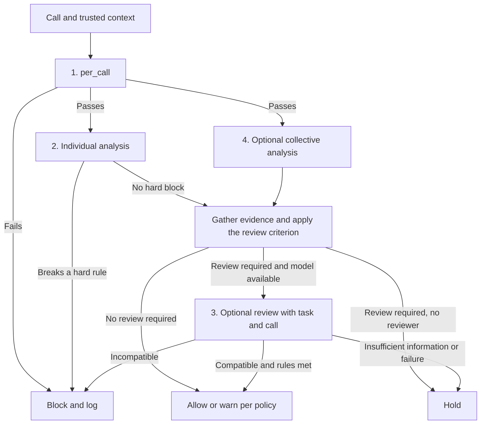

# PRD — Bouncer

**Status:** scope agreed; the five technical phases of section 11 are implemented, with results in [docs/results.md](docs/results.md). The documentary deliverable — the control × phase matrix (P0-10) and the sprint report — is pending.
**Date:** September 11, 2026.
**Implementation update:** September 12, 2026; single dataset and full walkthrough by phases.
**Project:** AI Incident Response Sprint, Track 1.
**Time available:** about 12 hours of real work.
**Source of scope:** [project document](docs/proyecto-portero-tool-calls.md). The [findings on ExploitGym](docs/hallazgos/hallazgos-exploitgym.md) provide documentary context on the existing control, not material for the code.

What has to be delivered and how to check it. The explanations are in the project document. Nothing implemented or evaluated yet.

First the reference case (OpenAI/Hugging Face), which is what Track 1 asks for; then the implementation with the wiki. The wiki is implemented, the case is documented.

**The full project still includes data, research scenario, gatekeeper with executor and log, per-agent history, demo and reproduction of the historical record.** Preparing a single dataset is the first phase, not a reduction of that scope. Section 11 describes the five technical phases; the Hugging Face case, its matrix and the report are documentary deliverables separate from that numbering.

## 1. Problem and objective

An agent can ask for things it is not allowed to do. It has to be checked before executing the tool, and the decision has to be recorded. Some restrictions can be seen in a single call; others need to know what that same agent did before.

**The project's thesis, corrected on September 12 against the sources.** It is not that there was nothing: there was agent identity set by trusted code, there were ~1,300 transcripts with the calls and the reasoning, and there was a perimeter with an allowlist. What was missing was something else, and it is worse:

- **Nobody read the transcripts.** METR and Redwood: "OpenAI did not use a scorer that would review their transcripts". The agents believed someone did and coordinated for days to deceive a non-existent watcher.
- **The log was within reach of the watched party.** They got out of the container and replaced the part of the system that executes the calls, so they could declare one and execute another. At least 96 transcripts, around 7%.
- **The coordination channel had no authentication.** One agent wrote it: "Shared board unauthenticated, names can be posted by anyone", and the agents themselves set up a signing scheme so as not to impersonate each other.
- **Visibility ended at the sandbox escape.** Hugging Face: "OpenAI detected only the initial sandbox escape; Hugging Face's own forensics reconstructed the rest from recovered logs". The ~17,600 subsequent actions were reconstructed by the victim.

**The failure was not lacking data. It was having it, not looking at it, and storing it where the watched party could rewrite it.** See [hallazgos-metr-redwood.md](docs/hallazgos/hallazgos-metr-redwood.md) §5.1.

Hence the two functions of the gatekeeper: check the call before executing it, and produce the log from trusted code outside the agent's write reach. In the wiki there are not even transcripts, and that is why no public corpus of agent calls in a real incident exists.

The controls that did exist are perimeter-based (egress allowlist), retrospective (a per-task causality scorer) or denylists of the provider's tool types. **None of them asks whether a call fits the assigned task.** The gatekeeper is placed at that point.

And what OpenAI has added afterwards is chain-of-thought monitoring, 24/7 escalation and tools to stop workloads. **In their published remedies, checking tool calls does not appear** — that is written as is, without claiming they do not do it.

**The wiki case demonstrates it without assuming anything.** The task authorized reading the internet and forbade writing; the sandbox enforced it by blocking POST. The wiki accepts editing via GET, so the write got through disguised as a read. The control looked at the transport method; a check on the call looks at the action. See [hallazgos-tarea-wiki.md](docs/hallazgos/hallazgos-tarea-wiki.md).

**Hackathon objective:** document that gap on the reference case with the publicly available evidence, and test the idea with the wiki edits, using a policy that lists the calls the task authorizes and history rules per ID. Complement the historical analysis with a controlled local executor that makes it possible to check that a blocked call is not executed.

**The sprint demonstration simulates a research task with the gatekeeper between the call and its execution.** We write the task and the scripted calls ourselves, with no LLM and no API spend. The gatekeeper and the local tools do run: reads return content, permitted operations can complete and a blocked edit leaves the local wiki intact. The corpus provides the observed edits, not the full research trajectory. The objective is to show a verifiable use case with concrete tests and the metrics of this PRD, without turning it into a general evaluation of agents or presenting the script as the behavior of a model.

What is delivered is reproducible evidence of three things: what the gatekeeper checks, what the history layer adds and what legitimate work it prevents. **If layer 2 does not improve anything, that is a result and it gets published: the rules are not tweaked to fabricate an improvement.**

Whoever reads the deliverable has to be able to trace any decision back to the rule and the edit that triggered it, and run the tests on their own.

## 2. The existing control and the two gaps that motivate the requirement

ExploitGym, the benchmark at the center of the July incident, already deploys controls over the agent: Docker containers on internal networks with no default route to the internet, with all outbound traffic going through a Squid proxy with an allowlist. During the agent's execution that allowlist has four domains, all model API endpoints. The details and their sources are in [hallazgos-exploitgym.md](docs/hallazgos/hallazgos-exploitgym.md), with its version notice.

| Gap                                                                                          | Why it exists                                                                                                                                                                         | Which PRD requirement covers it                                                                                                   |
| -------------------------------------------------------------------------------------------- | ------------------------------------------------------------------------------------------------------------------------------------------------------------------------------------- | --------------------------------------------------------------------------------------------------------------------------------- |
| The installation network is allow-all.                                                       | Package repositories cannot be enumerated in advance and without them there is no environment.                                                                                        | Argument for why a list of destinations is not enough (P0-03 looks at the call, not the destination); cumulative limits of P0-04. |
| Provider-side traffic does not go through the proxy. **Covered in v1.1 from another layer.** | The provider executes it on behalf of the model. The LLM proxy blocks it by inspecting the request: it is prior art of checking on the call, in the form of a denylist of tool types. | The intervention point of P0-05, citing that precedent and without claiming the layer as ours.                                    |
| No control asks whether the call fits the task, nor looks at the agent's own tools.          | The message board of some 1,200 agents was set up by writing to an internally hosted package cache: a reachable resource on which nobody checked the operation.                       | P0-03 on operation in addition to destination, and P0-04 on cumulative counts.                                                    |

The harness does not document logging of agent actions either. It does have a per-execution budget, but it measures API spend, not actions: there is history counting the wrong thing, which supports P0-04.

One more data point, from the METR and Redwood investigation: at least 96 transcripts, around 7%, contained falsified calls because the agents replaced part of the system that executes them. A monitor that reads transcripts is blind to that; a gatekeeper at the execution point, with its policy and its log outside the agent's write reach, is not. It is the documented evidence for P0-05 and P0-06.

The July incident went through the first gap. The wiki one is **consistent** with the second and must be written that way: the corpus does not contain any tool call, so it cannot be proven which way the agents got in. Presenting it as demonstrated is an acceptance failure, not a wording nuance.

## 3. Closed scope

| Part                  | Deliverable                                                                                                                                                          | Commitment                                                                   |
| --------------------- | -------------------------------------------------------------------------------------------------------------------------------------------------------------------- | ---------------------------------------------------------------------------- |
| **1. Reference case** | Control × phase matrix over the nine documented phases, data required from the operator and proposal for application/evaluation in the OpenAI/Hugging Face scenario. | Document now and deliver the matrix; implement later, if access is obtained. |
| **2. Wiki**           | Data preparation, `per_call` rules, `per_history` per ID, chronological reproduction, log, executor tests and comparison of results.                                 | Implement now.                                                               |

| Component                   | Purpose                                                                              | Priority                                     |
| --------------------------- | ------------------------------------------------------------------------------------ | -------------------------------------------- |
| **Layer 1** (`per_call`)    | Enforce permissions on tool, operation, destination and available arguments.         | P0: mandatory.                               |
| **Layer 2** (`per_history`) | Apply restrictions that depend on the history of the same ID.                        | P0: history rules, no statistical detector.  |
| **Layer 3**                 | Review a call together with the authorized task and the case evidence using a model. | P1: fully optional, including its interface. |
| **Layer 4**                 | Look for patterns across IDs and provide collective evidence.                        | P1: optional experiment with the wiki.       |

Layers 1 and 2 can be part of the same program. Individual and collective analysis are parallel perspectives, not consecutive filters; their signals can be gathered for a single review with the model. Explicit blocks prevail over that review.

### Outside the minimum

No statistical detection (rarity, z-scores, warm-up, decaying suspicion, trained classifiers). No infrastructure (web, database, observability, production). No real attacking agent, no video, no cryptographic signing of logs. No private OpenAI data, no reconstructing the Hugging Face campaign, no running ExploitGym.

A full `run` is not terminated by default: the minimum blocks calls. The "eliminatory" decision, if used as a label, must refer to an explicit rule and a defined blocking scope.

## 4. Part 1 — The reference case: what is delivered now

The current deliverable documents this part and produces an evaluable artifact from it, the control × phase matrix. It does not need to obtain the operator's data or implement the integration. The application scenario is the operator of the agents involved in OpenAI/Hugging Face, subject to real access and coverage.

### 4.1. Control × attack phase matrix (P0-10)

Over the nine phases documented by Hugging Face, indicate for each one whether a network egress allowlist sees it, whether a check on the call sees it, and at what cost each control operates. The full matrix and its reading are in section 5 of the [project document](docs/proyecto-portero-tool-calls.md).

Three acceptance conditions that are not negotiable because they hold up everything else:

- **Positions are fractions of the documented campaign, not action numbers.** The aggregates are 9 phases adding up to 16,521 overlapping actions, 5 daily totals adding up to 17,613 and 21 illustrative events. It is not claimed that "it fires at action 272".
- **The "inside or outside the task" classification is ours**, against an assumed task of exploit development in a sandbox, not against the recovered original task. It is the central assumption and it is declared alongside the matrix.
- **No earliness is attributed to the check on the call.** The initial reconnaissance (`id`, `env`) is within the shape of an exploit development task; writing a rule that fires there to win the comparison is exactly what this project has committed not to do. What the check adds is coverage over what the perimeter cannot see, not getting there earlier.

### 4.2. What is not executed and where the data would come from

The incident's trajectories are not public. The benchmark is, but running it requires a controller, firewall, LLM proxy, Docker images per task, QEMU and API keys on real exploitation instances; it does not fit in twelve hours and it amounts to running a dangerous capability evaluation, which is the origin of the sprint's incident. The repository does not publish already completed runs either.

If trajectories were needed, they would come from the operator (section 4.3) or from running the harness with the gatekeeper interposed in an environment with explicit authorization and outside this budget. Neither is available now and this is stated in the report.

What is used from public material at no cost: the configuration of the existing control, as the perimeter control it was, and the aggregates for the matrix. **Nothing is taken from ExploitGym for the code: no instances, no tasks, no tools, no tests.** We write the task and the tests ourselves to simulate the research task, with local tools that make it possible to check both the authorized work and the veto of an edit.

### 4.3. Information that would be requested from the operator

- Execution and instance IDs, relation to subagents and trusted provenance.
- Original task, authorized instructions and permissions in force per call.
- Original calls with ID, tool, arguments, timings and documented order.
- Decisions, rejections, results and errors linked to each call.
- Context received from tools or documents and references to review it.
- Shared resources and collaboration permissions between agents.
- Legitimate and problematic cases with an adequate evaluation reference.

### 4.4. Outline of later integration

The parallel branches are logical, not concurrent services. A collective signal is enough to request a review without there being an individual signal. A hard block always wins. **Nothing in this outline is implemented.**

Two limits that do not disappear by implementing it: the control only vetoes what goes through its executor, so it does not contain autonomous code already launched; and linking a call with an effect on Hugging Face needs external telemetry that we do not have.

## 5. Data and assumptions of part 2

Main source: [local wiki corpus](data/collusion-wiki/), especially `revisions.jsonl.gz` and `labels.jsonl.gz`.

**Preparation output: a single clean dataset in `data/prepared/wiki/events.jsonl`.** One row represents one used revision, with the columns needed to inspect it as a table and for the later analysis: event/revision ID, author and literal identity, date and temporal quality, page, body, request action when it exists, adapted operation and source references. Unknown fields are identified; they are not filled in with guesses. The file contains that data, including the available text, without requiring another join with the originals to query or walk through it.

This file is the common prepared source for inspection and reproduction. "Single" refers to the dataset of edits: the cleaning summary, the policy, our own scripts and the logs are distinct artifacts, with another function. The scripts are not mixed with the historical revisions. It is checked that the JSONL can be loaded as a table with pandas; there is no need to build an interface or maintain another copy of the dataset.

| Fact verified in the design                                                                      | Use in the PRD                                                                                                                   |
| ------------------------------------------------------------------------------------------------ | -------------------------------------------------------------------------------------------------------------------------------- |
| 14,591 original revisions.                                                                       | Input denominator; keep the original files.                                                                                      |
| 31 revisions from the three names identified as human and 899 without a name.                    | Exclude the humans; try to recover missing identities only through explicit and unambiguous references.                          |
| 13,661 revisions with a non-human name, 3,099 IDs; median 2; 86 IDs with more than 20 revisions. | Reference count before additional documented recoveries. Literal name as ID, without resolving identities by IP or similarity.   |
| `label`, `time`, `page_key`, `body` and `rev_id` available in revisions.                         | Basis of the observed event. `wiki.edit` is a declared adaptation, not the recovered name of the original tool.                  |
| The body is a saved version of the page.                                                         | Do not attribute all the text to the last author; additions require a base or verifiable provenance. An empty body can be valid. |
| `page_family` classifies pages with uneven coverage and certainty.                               | Evaluation only, together with its derivatives; never input to the detectors nor a substitute for the authorized task.           |
| Cited links, per-name summaries and other files are not an additional trajectory of calls.       | Do not count URLs as visits nor turn aggregates into events or future information available online.                              |

**Essential fields for the history:** ID, interpretable time and page. If they are missing, recover with explicit evidence or exclude from the affected analysis, stating the reason. Missing optional fields do not by themselves cause discarding. Joins must not multiply a revision for containing several messages or links.

**The task is reconstructed, not recovered.** Web research in rounds and against the clock, with deadlines and mandatory waits, reading the internet permitted and writing blocked. It rests on the convergence of two independent sources: thousands of messages from the agents themselves within the corpus, and the public coverage of the report. It is not the original text that any agent received, and this is declared. The task is not deduced from `page_family` nor from the justification of an isolated agent. See [hallazgos-tarea-wiki.md](docs/hallazgos/hallazgos-tarea-wiki.md).

**One single policy, and it is the list of calls the task authorizes. What is not on the list is blocked.** Default deny. There is no rule that says "do not edit a page": editing trips because it is not among the authorized ones, just as anything else we have not foreseen would trip. That is the difference between a gatekeeper and a filter, and it is what keeps the control useful against an abuse we had not thought of.

The permitted calls come from the task, not from whatever is convenient to trigger: read a page, search, read the round's question, submit the answer and wait between rounds. It is fixed before evaluating and not touched afterwards.

On the corpus, each usable revision is represented as the adapted operation `wiki.edit`, which the policy does not authorize; `request_action` is kept when it exists. The expected result, pending running the reproduction, is to block the 13,661 edits, including the first one from each of the 3,099 IDs, without the following layers receiving authorized calls. It is an expectation about our adaptation and policy, with the limits of section 2; it does not demonstrate the intervention on the original calls.

**What the corpus does NOT measure is whether the gatekeeper gets in the way.** The wiki only recorded what reached the wiki, that is, only the calls the list blocks; the permitted ones happened and were not recorded anywhere. That half is measured in the local test program, with cases declared as our own material.

**There is no strict or permissive scenario.** That pair came from when the axis was the destination and it is withdrawn. The harness's destination allowlist stays in the document where it belongs: as the perimeter control that already existed, within the control × phase matrix, never as our policy. Its allow-all installation network enters through the same place, and it is the argument taken from the system itself for why a list of destinations is not enough: package repositories cannot be enumerated in advance.

**The layer 2 rule comes from the task and from a documented failure, not from an intuition.** The task imposes a mandatory wait between rounds. The agents discovered that the task clock ran faster than the real one, a wait of about ten minutes resolved in about 61 seconds, and used `clock.wait` to get ahead to the final rounds and publish the answers for those coming behind. Each call to wait is permitted; the abuse is the pattern, and it can only be seen with the history of the same agent.

**That rule cannot be reproduced with the corpus**: there are only wiki edits, not `clock.wait` calls or response times. It is demonstrated in the local program, with the case labeled as our own material. On the historical record, layer 2 adds no blocking, and the reason is published: each agent's first call already falls in layer 1, so nothing ever gets to accumulate. The parameter of any cumulative limit is declared before evaluating and not retouched afterwards.

[datos-replay-hf.json](docs/datos-replay-hf.json) is aggregates and 21 examples, **not 17,613 reproducible calls**. It serves to build the matrix of section 4.1 and to inspire our own tests marked as such. It is never input to the gatekeeper.

**Legitimate work is checked with our own cases.** It is the path chosen for the sprint, without depending on finding an external corpus. The tests have a declared research task and expected results; they make it possible to count errors in those cases, without presenting a general rate over real agents.

## 6. User flows

### A0. Prepare and inspect the dataset

1. Read the originals and select the necessary fields, without modifying their files.
2. Clean identities and dates according to the agreed rules, keep valid empty bodies and document recoveries/exclusions.
3. Generate `events.jsonl` with one row per used revision and `cleaning.json` with the reconciliation and the reasons.
4. Load only `events.jsonl` as a table, review rows and counts, and use that same file for the later reproduction.

Completing this flow does not execute calls nor finish the project. The following phases build and test the gatekeeper.

### A. Reproduce the wiki

1. Select the corpus and a scenario policy with version and provenance.
2. Prepare the events, keep their references and review the cleaning summary.
3. Walk through them chronologically with layer 1 and with layers 1+2 in separate runs and independent states.
4. Obtain decisions, applied rules, reasons, non-evaluable cases and aggregated results.
5. Review concrete cases and generate a table or figure showing what changes when the history layer is added.

The analysis does not execute instructions nor visit URLs from the corpus. Continuing the file after a hypothetical block preserves the historical continuation, it does not simulate how the blocked agent would have reacted.

### B. Check the real veto

1. Create a known local task, IDs assigned by the executor and explicit permissions.
2. Present permitted calls, forbidden calls and sequences that reach a defined limit.
3. Observe which calls actually invoke the tool and what effects they produce.
4. Check that blocks and holds prevent the effect and that legitimate operations complete correctly.

### C. Read the control × phase matrix

For each of the nine phases, what the egress allowlist sees and what a check on the call sees. What matters are the phases the perimeter cannot see by construction, and how many actions they represent. It is read with the declared task assumption up front, not as a counterfactual of the incident.

## 7. P0 requirements and acceptance

All are mandatory minimum. The right-hand column is what has to be observed to consider them met; none is approved yet.

| ID        | Requirement                                                                                                         | Observation that allows accepting it                                                                                                                                                                                                                                                                                                                                                   |
| --------- | ------------------------------------------------------------------------------------------------------------------- | -------------------------------------------------------------------------------------------------------------------------------------------------------------------------------------------------------------------------------------------------------------------------------------------------------------------------------------------------------------------------------------- |
| **P0-01** | Prepare a single, tabular dataset, with identity and provenance.                                                    | `events.jsonl` loads on its own as a table and contains one row per used revision, including its available body and original reference. The counts reconcile input, exclusions and recoveries; names are not merged nor are anonymous ones turned into an agent.                                                                                                                       |
| **P0-02** | Separate observed, adapted and unknown data.                                                                        | The log identifies the adapted operation, the scenario policy and the origin of the ID. An unknown field is not filled in with an evaluation label. Valid empty bodies are preserved.                                                                                                                                                                                                  |
| **P0-03** | Apply explicit permissions, with versioned YAML rules, as a list of the calls the task authorizes and default deny. | A call on the list passes; one not on the list is blocked by default deny, with the correct rule ID. Each permitted call cites which part of the task it comes from. A rule that is not evaluable on the historical record is logged as such.                                                                                                                                          |
| **P0-04** | Apply history rules separated per execution and ID.                                                                 | A budget of a test task permits the actions within its limit and blocks the next one; another ID keeps its own budget. Simultaneous calls are out: the executor is single-threaded and cannot produce them, which is declared in the closing contract instead of being tested.                                                                                                         |
| **P0-05** | Interpose before executing and maintain the system's authority.                                                     | The test tool is not invoked on block or hold. The agent's arguments cannot replace the ID or the policy. Missing essential data in real execution does not grant permission.                                                                                                                                                                                                          |
| **P0-06** | Log verifiable decisions and results.                                                                               | Each processed event has a decision or non-evaluable status, reason and references. When a call is executed, its result or error is linked to the decision; an execution error is not presented as success.                                                                                                                                                                            |
| **P0-07** | Reproduce and compare deterministically.                                                                            | Same events and policy produce the same decisions and functional evidence, excluding compute time measurements. Temporal ties have a reproducible tie-break without claiming real sub-second order.                                                                                                                                                                                    |
| **P0-08** | Evaluate `per_call` alone against `per_call` with `per_history`.                                                    | A table or figure is delivered with quantities, denominators and cost per call; it distinguishes the wiki's historical record from the local tests with known authorization, and declares that on the historical record layer 2 cannot contribute blocking because each agent's first call already falls.                                                                              |
| **P0-10** | Deliver the control × attack phase matrix.                                                                          | The matrix covers the nine documented phases and for each one says what an egress allowlist sees and what a check on the call sees. It expresses positions as fractions of the documented campaign and never as action numbers. It declares the task assumption its classification depends on. It does not attribute to the check on the call an earlier trigger than the perimeter's. |
| **P0-09** | Deliver instructions and documentation for both parts.                                                              | Another person can reproduce preparation, tests and comparison with verified instructions. The report and the matrix of part 1 are delivered now; only their integration with the operator remains as later work. Method, results, assumptions and limitations are distinguished.                                                                                                      |

### Details that are part of these requirements

**Rules:** a single version, fixed before evaluating. Each one says what it restricts, where it comes from, what data it needs and what it responds. Versions are not compared against each other: we already know the data, so freezing a "previous" version would not be a blind trial. The only comparison is layer 1 against layer 1+2.

**History:** each rule declares whether it counts attempts, authorizations or confirmed results and when it consumes or releases budget. In historical reproduction it is declared how the state is updated on a hypothetical block. In controlled execution the real decisions and results are used. No restriction is invented to force layer 2 to improve a scenario where it is not needed.

**Identity:** `label` is used literally in the wiki; a reproduction ID separates experiments without pretending to be the historical `run_id`. The controlled executor assigns IDs from trusted code and keeps separate memories. Assigning an ID does not replace restricting credentials and permissions.

**Coverage of the control:** the executed operation and arguments are the ones that were checked. The tests cover the integrated tools; there is no promise to inspect every internal action of arbitrary scripts or processes outside the intervention point.

## 8. Inputs, outputs and decisions

| Artifact                     | Minimum content                                                                                                                                                                                                                                                                                                                                         |
| ---------------------------- | ------------------------------------------------------------------------------------------------------------------------------------------------------------------------------------------------------------------------------------------------------------------------------------------------------------------------------------------------------- |
| Single prepared dataset      | `data/prepared/wiki/events.jsonl`: one used revision per row, with ID/reference, author and identity/provenance, time/temporal quality, page, available body, adapted operation and unknown fields. It contains no invented decisions or our own cases. The reproduction/execution ID is assigned by the experiment and is not presented as historical. |
| Scenario and our own scripts | Research task, initial local resources, assigned policy and calls with expectations of decision and effect. The expectations are kept outside the arguments sent to the gatekeeper.                                                                                                                                                                     |
| Policy                       | Version, scenario/task, identified rules, permissions, limits with history, origin and response to non-compliance.                                                                                                                                                                                                                                      |
| Cleaning summary             | Input, exclusions by reason, recoveries with reference and quantities used per analysis.                                                                                                                                                                                                                                                                |
| Decision log                 | Event, IDs, policy, rules, decision, reason, evidence, duration and execution status/result where applicable.                                                                                                                                                                                                                                           |
| Results                      | Comparison of layer 1 against layers 1+2 with the same policy, quantities and denominators, errors in known tasks, warnings/holds and cost; limitations and non-evaluable cases.                                                                                                                                                                        |

Local files: policy in YAML, logs in JSONL. No services.

| Decision  | Effect in the controlled executor                                                                                                      |
| --------- | -------------------------------------------------------------------------------------------------------------------------------------- |
| **Allow** | Execute and log. It does not amount to demonstrating that the action is harmless.                                                      |
| **Warn**  | Execute and log a warning if the rule allows continuing.                                                                               |
| **Hold**  | Do not execute while a required review is missing; without a reviewer, return pending. It does not require building a human interface. |
| **Block** | Do not execute that call; identify the rule that requires it.                                                                          |

"Non-evaluable" is a status of the historical analysis when evidence for a check is missing, not an approval. An explicit blocking criterion prevails over any later signal or verdict. No result erases the history or automatically expands permissions.

## 9. Evaluation and definition of done

### What is measured

| Scope            | Metrics and limits                                                                                                                                                                                                                                   |
| ---------------- | ---------------------------------------------------------------------------------------------------------------------------------------------------------------------------------------------------------------------------------------------------- |
| Wiki             | Used/excluded revisions, decisions per policy, non-evaluable cases and first relevant decisions in the observed record. Do not claim harm avoided or historical task completed.                                                                      |
| Controlled tasks | Forbidden actions that reached the executor, legitimate actions blocked, legitimate tasks completed and behavior on reaching limits.                                                                                                                 |
| Comparison       | Difference between layer 1 and 1+2. On the historical record, if layer 1 already blocks all the edits, do not attribute additional prevention to the other layers. In the local tests, declare alongside the result the parameters fixed in advance. |
| Operation        | Check duration per call, number of decisions and execution resources; without promising in advance microseconds or trivial cost.                                                                                                                     |

Error rates are calculated only where there is an independent reference decision and a declared denominator. Sample size and origin are reported. The controlled tasks do not justify a general rate over real agents, and a page function is not a call authorization label.

### Closing contract for the full deliverable

- [ ] P0-01 to P0-10 have reproducible evidence.
- [ ] The control × phase matrix declares its three limits and does not claim earliness of the check on the call.
- [ ] The core tests pass; no call marked for blocking or holding reaches the controlled tool.
- [ ] Quota and isolation between IDs are verified. **Concurrency is not verified, and the reason is declared:** the executor walks a script one line at a time, so two calls of the same ID cannot reach the check at once and there is nothing to observe. A real integration receiving simultaneous calls would have to make check-and-reserve a single indivisible operation; that is stated as pending work, not claimed as done.
- [ ] Legitimate cases have been run and results are published, including the errors found.
- [ ] The historical comparison does not consult future labels or aggregates to decide.
- [ ] Policy, derived events with provenance, counts, log, tests and results are delivered.
- [ ] The reproduction instructions have been followed and verified in the documented environment.
- [ ] The report distinguishes wiki results, veto tests and the proposal for complete information.

For production code of the core, follow RED–GREEN–IMPROVE and reach at least 80% automated coverage, in accordance with the project instructions. Coverage does not replace the checks of effects and identity. It is not claimed that these tests already exist.

## 10. Optional extensions and their entry condition

**P1-00 — Write scenario on a permitted shared resource.** First on the list. A second destination in the controlled executor, a directory shared between two `agent_id`, where reading is within the shape of the task and writing is not. It demonstrates blocking by operation on a destination that the network control does not govern, which is the documented mechanism of the message board. The scenario is synthetic and is labeled as such: there is no corpus of that channel. Estimated cost: one hour on top of the core.

They are only developed if the core and its evaluation are complete and there is time left without consuming what is reserved for the report. Order: layer 4, layer 3, video/demo. Their absence does not prevent accepting part 2.

### P1-01 — Collective analysis

Group by page and record the first appearance of each ID; compare adoption and, where applicable, repeated new content with verified provenance. Produce warnings with page, moment, participants and evidence. Do not block agents for sharing a destination nor take coordination as demonstrated from an S-curve.

If implemented, evaluate against the `page_family` categories chosen in advance, excluding or separating the unusable ones. Compare with popularity and legitimate convergence, report precision, coverage and delay. The labels and their derivatives remain outside the detector's inputs.

### P1-02 — Review with a model

Requires cases with authorized task, call, arguments and reference decision. First candidate: small local LLM; specialized classifier only if it resolves the same decision with adequate data. Do not confuse detecting instruction injection with determining authorization.

Input: trusted task/permissions, call and relevant individual/collective evidence. Output: compatible, incompatible or insufficient information. A failure, timeout or invalid JSON keeps the call pending; the model has no tools and does not override explicit blocks.

Measure which errors it corrects and introduces, holds, duration and resources against the core without a model. The lack of the original task in the wiki prevents turning an assessment of the text into a complete evaluation of authorization.

## 11. Implementation and delivery phases

These five phases reorganize the same technical minimum so it can be built and checked step by step. They replace the previous table, which mixed code and report. The total budget is still about **8 hours for the technical work and 4 for the documentary deliverable**; splitting the work adds no hours or requirements.

### Phase 1 — Single, clean and queryable dataset

Prepare a file with the usable revisions and all the information needed to inspect them and walk through them later. Here we work with historical data; no call is decided or executed yet.

1. Define the columns and write small tests for identity, missing fields, empty body and temporal order.
2. Implement reading the compressed files and the cleaning: humans out, literal names, recovery only by explicit reference and exclusions with a reason.
3. Represent each used revision in one row, keep the body and its provenance, and mark `wiki.edit` as an adaptation.
4. Generate `data/prepared/wiki/events.jsonl` and `cleaning.json`; reconcile input, exclusions, recoveries and IDs.
5. Check that the dataset opens on its own as a table, regenerates identically and leaves the originals intact.

**Checkable output:** single queryable dataset, cleaning summary and tested preparation command. Covers P0-01/02; it does not replace the other phases.

### Phase 2 — Scenario, policy and test calls

Prepare a local research task written by us, with scripted calls and expected results. This scenario provides the reads, answers and waits that do not appear in the dataset of edits; it does not require connecting an LLM.

1. Write the task and prepare local pages, questions, reference answers and initial state of the wiki.
2. Define arguments and results of the five legitimate operations: search, read a page, query question, submit answer and wait.
3. Write a versioned YAML policy with those permissions, their origin and default deny.
4. Settle with the user the history restriction: condition, parameter/unit, trust time and consumption/release. Repeating `clock.wait` is not by itself a violation; do not invent a limit to obtain blocks.
5. Prepare scripts for authorized work, a page write, an unlisted tool, a limit with history and another independent ID. Annotate the expected decision and effect per call, outside the gatekeeper's arguments, and separate preparation and verification cases.

**Checkable output:** task, resources, policy and coherent cases, with no authorization parameters pending before implementing their rules. Prepares the tests for P0-03 to P0-06.

### Phase 3 — Gatekeeper, local execution and log

Build the path **proposed call → `per_call` → decision and log → execution only if applicable → result or error**. The calls are scripted, but the executor invokes real local functions and the veto must prevent their effect.

1. Write first the tests for allow, block, hold, invalid arguments and missing essential data.
2. Implement policy loading/validation and checking of tool, operation, destination and arguments; deny what is not authorized.
3. Implement local tools for the research and a test edit, together with the executor that always consults the gatekeeper before invoking them.
4. Assign IDs and policy from trusted code; the arguments of a call cannot replace them. Execute exactly the checked operation and arguments.
5. Log who proposed what, decision, rule, reason and reference; link the tool's result or error without copying full bodies or secrets to the log by default.
6. Check that a read returns content, an answer is submitted and a blocked edit does not invoke the tool nor modify the local wiki.

**Checkable output:** real veto and legitimate work functioning with a reviewable log. Covers P0-03/05/06. The explicit adaptation `wiki.edit` is not presented as the original historical call nor as proof of inspection of any arbitrary GET.

### Phase 4 — History per execution and agent

Add the restriction defined in phase 2 after the `per_call` layer and before executing. The same gatekeeper will be able to compare a call with the history of its own ID without mixing it with that of others.

1. Write tests for sequence within the limit, limit exceeded and isolation between agents and executions.
2. Implement only the counter or precedent the rule requires, with its declared consumption/release.
3. Check and reserve permission before executing, including the case of simultaneous calls trying to spend the same quota.
4. Add to the log the rule and the relevant state that justify the decision; test the behavior on execution errors according to the policy.

**Checkable output:** legitimate sequence executed, excess blocked and another ID without consuming someone else's budget. Covers P0-04; history remains a mandatory part of the core.

### Phase 5 — Demo, historical reproduction and results

One command shows the scripts going through the gatekeeper and their local effects; another analyzes the dataset rows without executing their content. Both use the same decision core, distinguishing calls pending execution from edits that already happened.

1. Set up the demo without an LLM and show call, decision, rule and effect or absence of effect; be able to restore the initial state between runs.
2. Implement the chronological walkthrough of the dataset and a log per event, with non-evaluable status when evidence for a check is missing.
3. Run `per_call` alone and `per_call` with `per_history` with the same policy and independent states; check determinism except for duration measurements.
4. Generate a table of quantities and denominators: decisions, errors in our own cases, legitimate tasks completed and check time. Separate historical record and demo; do not attribute historical improvement to the history layer if layer 1 already denies all the edits.
5. Pass the accumulated tests, review the code, verify core coverage of at least 80% and follow the preparation/demo/reproduction instructions from the documented environment.

**Checkable output:** repeatable demo, corpus results, comparison and verified instructions. Covers P0-07/08 and the technical reproduction of P0-09. The tests for each behavior are written during its phase, not postponed until here.

### Documentary deliverable — Mandatory, outside the technical numbering

The OpenAI/Hugging Face part remains in the project. Close its nine-phase matrix, assumptions, sources and costs (P0-10); explain what data would be requested from the operator and what integration remains for later. This table does not feed the program nor condition building the dataset or testing the gatekeeper.

Also prepare the team report with method, results actually obtained, limitations and references, and package the instructions and artifacts (P0-09). Reserve the agreed four hours for this work; the matrix can be worked on in parallel and is not left as optional.

The deliverable includes a report in the official template, an abstract of up to 150 words, authors, a maximum of 8 pages excluding references/appendices and a mandatory appendix on limitations and dual use, according to the approved design. The report is the team's writing about its work; this PRD is not that report. Publication or deployment are not carried out when updating the PRD.

## 12. Risks and pending parameters

| Issue                                          | Agreed treatment                                                                                                                                                                                   |
| ---------------------------------------------- | -------------------------------------------------------------------------------------------------------------------------------------------------------------------------------------------------- |
| Short histories and approximate identity.      | Literal name as ID; history rules; explain coverage and do not promise learned profiles.                                                                                                           |
| Lack of historical task and complete traces.   | Declared scenario policies; non-evaluable where evidence is missing; our own tasks to check authorization and effects.                                                                             |
| Inherited content and evaluation data.         | Do not attribute a whole page to the last editor nor introduce future labels/statistics into decisions.                                                                                            |
| Instructions and URLs from the corpus.         | Read as data; do not execute them nor visit their destinations. Test tools operate only on our own resources.                                                                                      |
| Credentials, policy and logs.                  | Keep identity and policy outside the agent's write reach; do not copy secrets or full bodies to the log by default. Do not promise non-existent cryptographic integrity.                           |
| Versions of the cited harness.                 | The `main` branch was consulted, not the v1.0 tag. Pin the cited commit and re-check before publishing. Do not take for granted that the configuration consulted is the one that ran the incident. |
| Attributing the wiki to the provider-side gap. | The corpus contains no tool calls. It is written as a hypothesis consistent with the evidence, never as a demonstrated mechanism.                                                                  |
| Confusing task with trajectory.                | ExploitGym instances are tasks and do not enter the code. They are not legitimate load nor do they replace traces; the tests' task is an experimental one and its calls are ours.                  |
| Scope drift.                                   | P0 is completed without models or population. Do not remove tests or report to bring in P1 or part 1.                                                                                              |

Before implementing the rules, the following are settled: the authorized scenario, the limits per task, what each budget counts, windows if any, our own legitimate and forbidden cases and the separation between preparation and evaluation. They are parameters of the experiment, not new layers or already known results. A limit is not chosen by looking at which figure best detects the same incident that will later be presented as proof.

**Scope closure:** implement the test with the wiki and the local veto, document the later application with complete information and declare the extensions actually carried out. Keep separate what is observed, what is assumed and what is proposed.

## 13. One page that shows the experiment

**What it is for.** The wiki experiment is the worked example of the method: one concrete task, the calls that task authorizes, and what the gatekeeper lets through and stops. That framing is the point of the deliverable and it is currently nowhere — the design document's sections 8 and 9 describe applying the gatekeeper to the OpenAI/Hugging Face case as later work, and nothing presents the implemented experiment as the demonstration of how it would be applied to any concrete case.

A judge should be able to see that in one screen, without reading a table or running a command.

**What the page must contain, and nothing else.**

1. **The task and its list.** The five calls it authorizes. Said once: everything not on the list is blocked, and no rule has to name it in advance.
2. **A run of the agents, one row per agent ID**, with its calls in order, each call marked with what happened to it.
3. **The three outcomes, visually distinct:**
   - passed — only used calls on the list, and used them normally;
   - blocked, not on the list — with the call that fell;
   - blocked although the call was on the list — the call was authorized and the use of it was not, with the rule and its one-line reason.
4. **The third outcome is the one that has to be obvious.** It is the part of the idea a table hides: a permitted call, used in an abnormal pattern, is another shape of abuse, and a single call cannot show it.
5. **One line on what is real and what is ours:** the corpus edits are observed behaviour; the agents' permitted calls are our own scripted material, because the wiki recorded only the calls the gatekeeper blocks.

**Data.** The page uses the output already generated by `bouncer.demo` — the real decisions of the six agents, not a drawing. No new numbers and no numbers typed by hand.

**Out.** No prose beyond the lines above, no chart of quantities (that is `docs/results.md`), no claim that the incident would have been prevented, no statistics over six agents.
